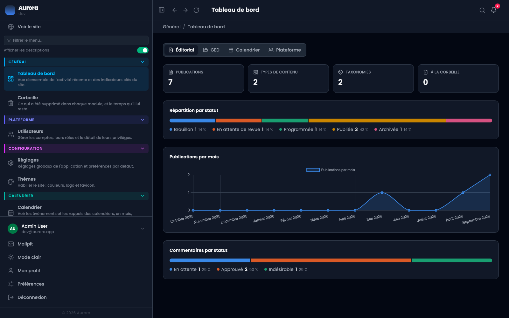

C'est le premier écran après la connexion, et il répond à une seule question : où en est le site. Rien ne s'y règle, tout s'y lit.

## Un onglet par module actif

Les compteurs sont regroupés par module, et un module éteint n'a pas d'onglet. Aujourd'hui quatre modules en alimentent un :

- Éditorial : le nombre de publications, celui des types de contenu, celui des taxonomies, et ce qui attend à la corbeille.
- Médiathèque : les documents, les catégories, les étiquettes et les dossiers.
- Calendrier : les agendas, les rappels en retard et ce qui arrive, chacun cliquable vers l'événement.
- Plateforme : les comptes.

## Les graphiques

- La répartition des publications par statut, en une barre : brouillon, programmée, publiée, archivée, avec le compte et le pourcentage de chacun.
- Les publications par mois sur douze mois, pour voir le rythme plutôt que le total.
- Les commentaires par statut : en attente, approuvés, indésirables.

## Ce que « à la corbeille » recouvre

Uniquement les publications : c'est un compteur de l'onglet Éditorial, pas de l'application. Ce qui a été supprimé partout ailleurs se lit sur l'écran **Corbeille**, qui rassemble les cinq corbeilles et dit ce qu'il reste de temps à chacune.

## Ce qui n'y est pas

Les notifications ne s'affichent pas ici mais dans la cloche en haut à droite, parce qu'elles demandent une décision et que le tableau de bord ne demande rien. Et il ne montre que ce que le compte a le droit de voir : un compte sans privilège sur la médiathèque n'a pas son onglet.
