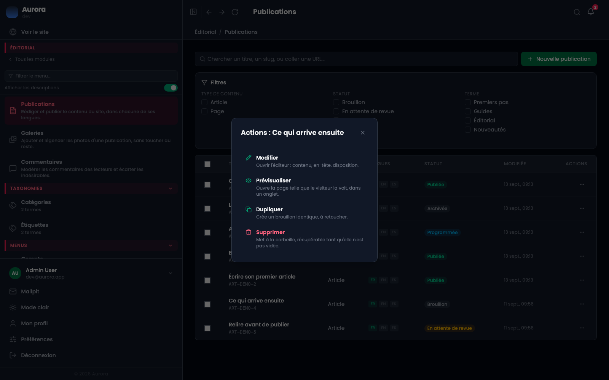
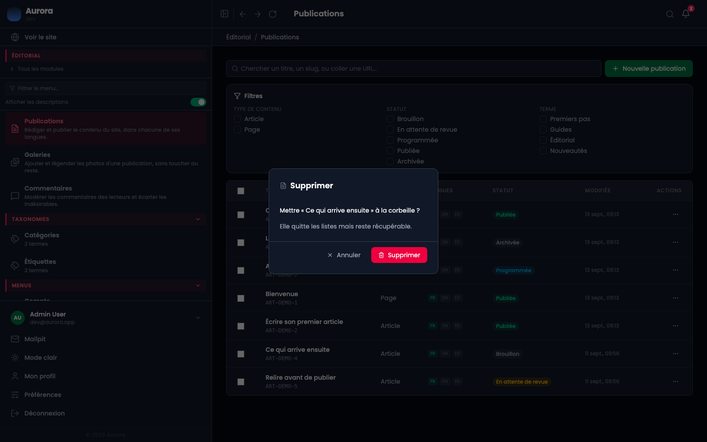
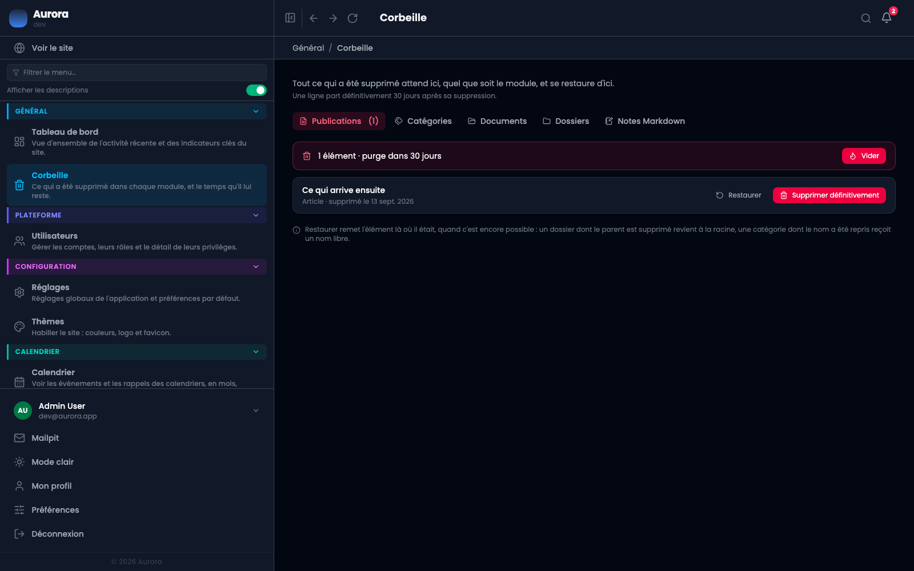

Supprimer, dans Aurora, ne veut presque jamais dire effacer. Un document, un dossier, une catégorie, une publication, une note : tout part à la corbeille et reste récupérable. **Général > Corbeille** est l'endroit où ce qui a été supprimé se retrouve, se restaure, ou s'efface pour de bon.

## 1. Supprimer, depuis l'écran où l'on travaille

Rien ne change à l'endroit de la suppression. Le menu d'une ligne propose **Supprimer**, et le texte sous l'action dit ce qui va se passer.

La fenêtre nomme l'élément et rappelle qu'il reste récupérable.

## 2. L'écran Corbeille

Un onglet par type, avec le nombre en attente. Ce qui n'est pas vide passe en premier : la page existe pour dire ce qu'il y a à traiter.

Sous les onglets, une ligne par élément, avec la date de suppression et **le nombre de jours qui reste avant la purge**. Ce délai est réglé dans Configuration > Lecture, trente jours par défaut.

## 3. Restaurer, ou effacer pour de bon

Chaque ligne porte les deux gestes. **Restaurer** remet l'élément là où il était, quand c'est encore possible : un dossier dont le parent a été supprimé revient à la racine, une catégorie dont le nom a été repris entre-temps reçoit un nom libre. **Supprimer définitivement** est le seul geste de cette page qui ne se rattrape pas, et il demande confirmation.

**Vider**, en haut, efface d'un coup tout ce que l'onglet contient.

## 4. Ce que la page ne montre pas

Ce que vous n'avez pas le droit de voir. Une corbeille dont le privilège vous manque n'a pas d'onglet du tout, les publications n'y apparaissent que si vous en êtes l'auteur — sauf pour un développeur ou un administrateur — et les notes sont toujours les vôtres seules.

## 5. Ce qui n'a pas de corbeille

Les formulaires, les menus et les taxonomies s'effacent immédiatement. Un contrat scellé, lui, ne s'efface pas du tout avant la fin de sa durée de rétention, et un client nommé par un contrat ne se supprime pas : ce sont des règles de comptabilité, pas une corbeille.
