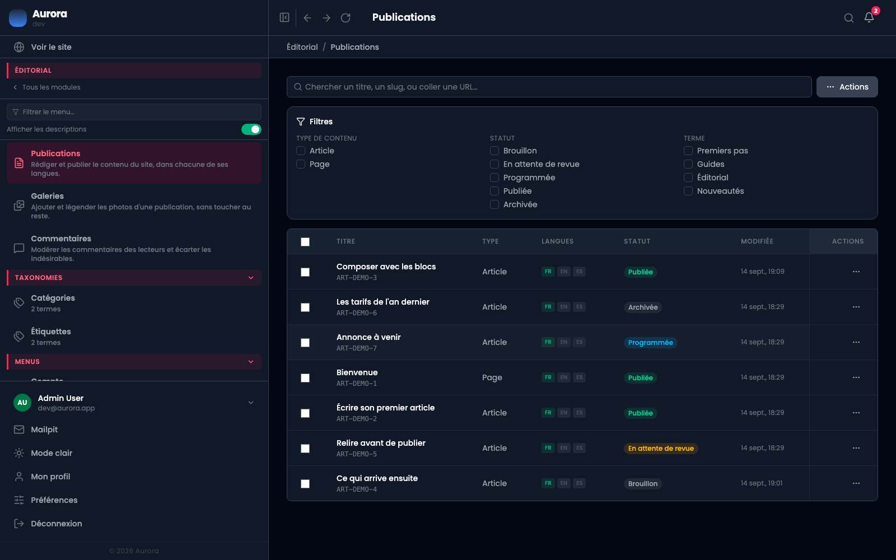
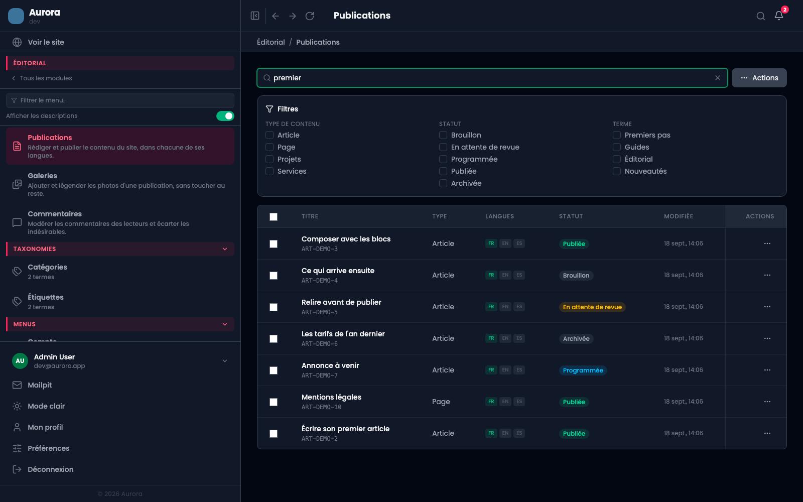
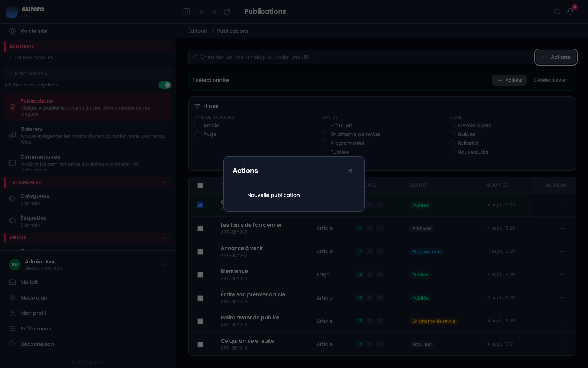

Tout le contenu du site passe par cet écran : les pages, les articles, et les types que vous avez créés vous-même.

## 1. La liste et ses filtres

Trois familles de filtres, cumulables : le **type de contenu**, le **statut**, et les **termes** de taxonomie. Les colonnes montrent le type, les langues dans lesquelles la publication existe, son statut et sa date de modification.

Les langues sont une information utile au premier coup d'œil : une pastille éteinte signale une traduction qui manque, et une publication non traduite n'apparaît pas du tout sur le site dans cette langue.

## 2. La recherche

Elle porte sur le titre, l'adresse, et accepte aussi qu'on lui colle une URL complète : pratique quand on a la page sous les yeux et qu'on veut la retrouver ici.

## 3. Les actions en masse

Cocher une ou plusieurs lignes fait apparaître les trois actions : publier, repasser en brouillon, mettre à la corbeille.

Elles s'appliquent à la sélection entière, y compris aux publications que le filtre courant ne montre pas si la sélection les inclut. Vérifiez le compteur avant de cliquer.

## 4. La corbeille

Cette liste ne montre que les publications en ligne ou en brouillon. Une publication mise à la corbeille n'est plus ici : elle attend dans **Général > Corbeille**, avec ce qui a été supprimé dans les autres modules, et c'est de là qu'elle se restaure.
