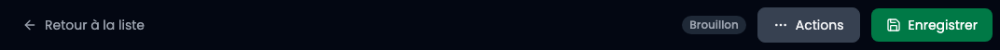
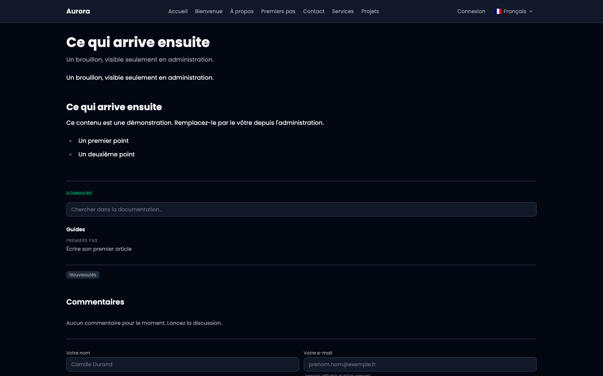

Un lien qui rend la page telle qu'elle sera, sans la publier et sans demander de compte à celui qui l'ouvre.

## 1. Prévisualiser, dans le menu Actions

Il est en haut de l'éditeur, à gauche d'**Enregistrer**. Il enregistre d'abord, puis ouvre la page dans un nouvel onglet : un aperçu du dernier enregistrement serait l'aperçu de quelque chose que vous n'avez pas sous les yeux.

Il n'apparaît que sur une publication déjà créée : un aperçu a besoin d'une adresse, et un formulaire jamais enregistré n'en a pas.

## 2. La page telle qu'elle sera

L'onglet qui s'ouvre montre la publication rendue par le site : la grille, l'en-tête, la galerie, le thème. C'est la page, pas un aperçu approximatif.

L'adresse contient un jeton. Elle s'envoie telle quelle, à quelqu'un qui n'a pas de compte, et elle vit **sept jours**. Les liens expirés sont purgés tout seuls.

## 3. Ce n'est pas une publication

À son adresse publique, la même page n'existe pas encore : le site répond qu'elle est introuvable. Elle n'est pas indexée, elle n'apparaît ni dans les listes ni dans le plan du site, et le lien ne donne accès à rien d'autre qu'à elle.

