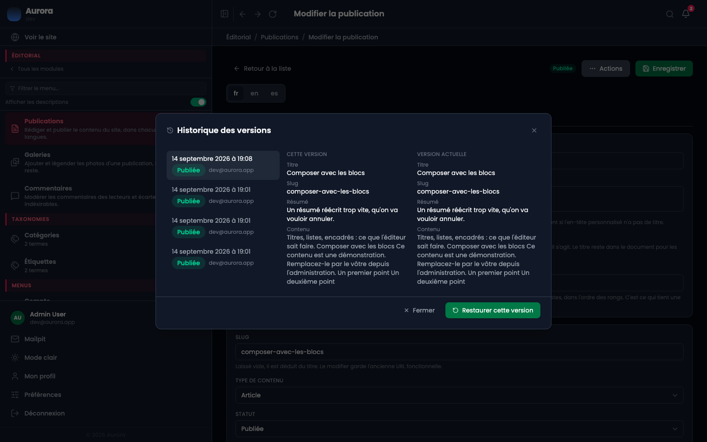
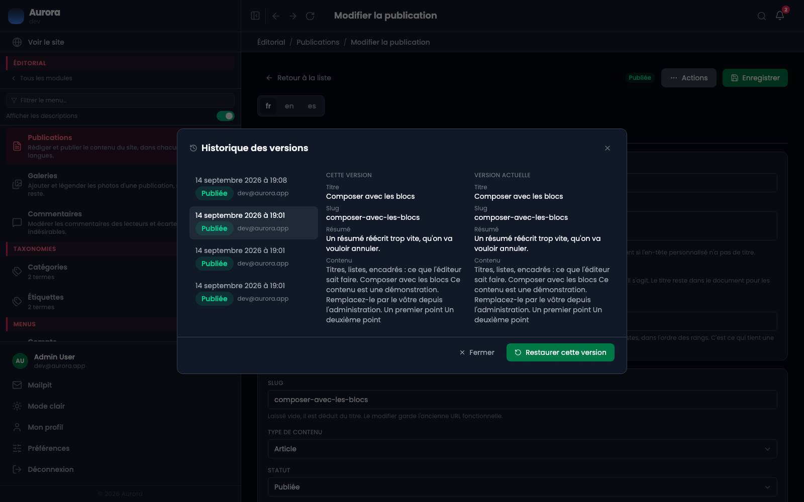
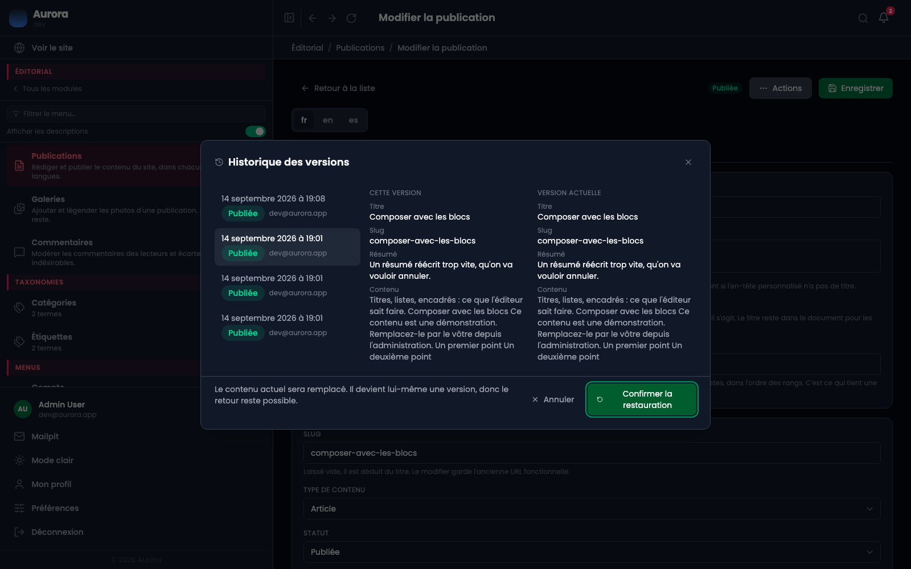
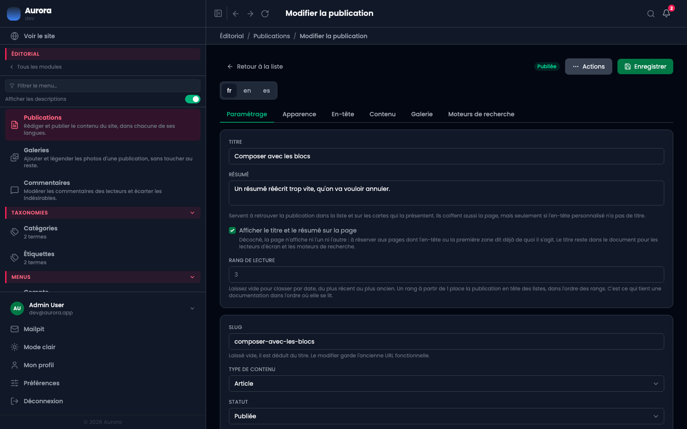

Chaque enregistrement laisse une trace de l'état précédent. On peut comparer, et restaurer, sans avoir rien eu à activer.

## 1. Historique, dans le menu Actions

Il est en haut de l'éditeur, à gauche de **Prévisualiser**. Comme lui, il n'apparaît que sur une publication déjà enregistrée : une page qui n'a jamais été écrite n'a pas de passé.

## 2. Ce qui est gardé

Une version par enregistrement, la plus récente en tête. Chacune porte sa date, le statut qu'avait la publication à ce moment, et la personne qui a enregistré.

- Le nombre de versions gardées est un réglage, **vingt par défaut** : au-delà, les plus anciennes tombent.
- Une version garde le contenu de chaque langue, sa grille, son en-tête et ses réglages de référencement.
- Rien n'est à activer, et rien n'est à nettoyer : l'élagage se fait à l'enregistrement.

## 3. Comparer

Choisir une version l'affiche à côté de la version actuelle : le titre, l'adresse, le résumé et le texte du contenu. C'est ce qu'il faut pour reconnaître une version, sans avoir à la restaurer pour la lire.

La comparaison porte sur la langue en cours d'édition. Une version antérieure à l'ajout d'une langue ne la contient pas, et le dit.

## 4. Restaurer

**Restaurer cette version** demande confirmation avant d'écrire : le contenu à l'écran va être remplacé, et un clic mal visé sur une ligne sélectionnée par le simple fait d'avoir ouvert le panneau coûterait cher.

## 5. Le retour est lui-même annulable

Restaurer écrit le contenu de la version choisie sur la publication, et cet enregistrement crée une version de plus : celle qu'on vient de remplacer. Se tromper de version n'est donc pas grave, il suffit de recommencer.

La restauration demande le droit de modifier la publication. Qui peut la lire sans la modifier voit l'historique et ne peut pas y toucher.

