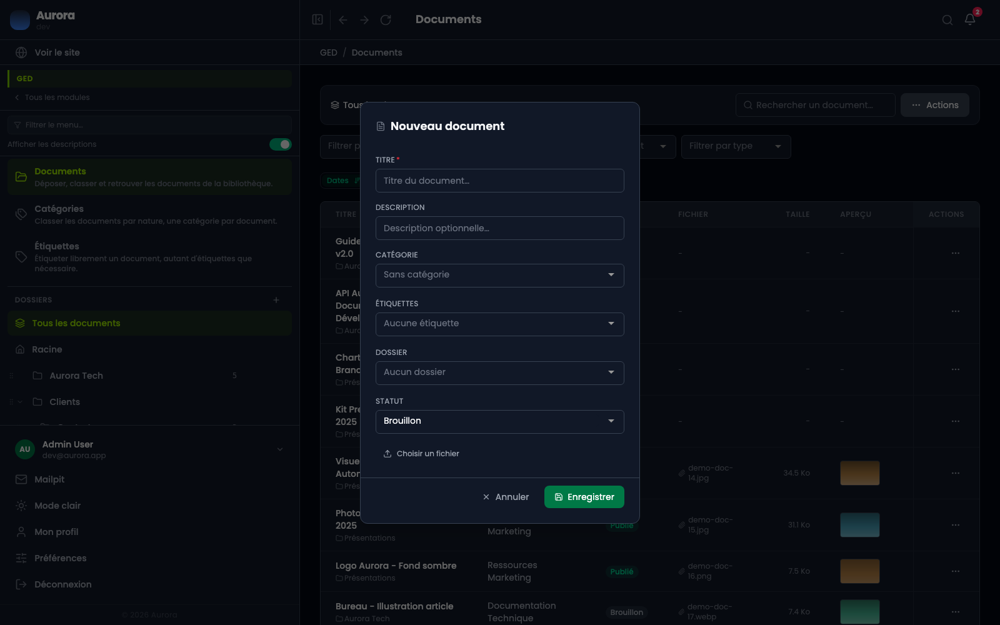
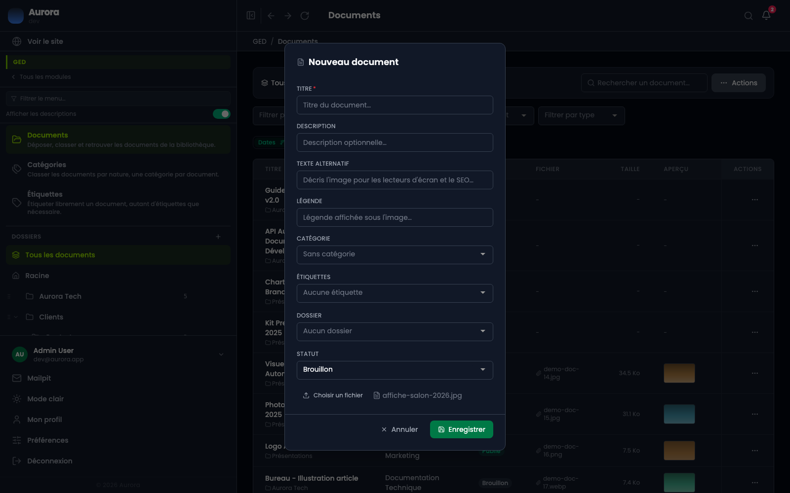
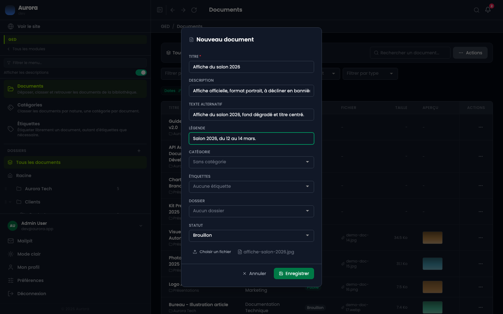

Les images d'un site finissent en général dans un dossier que personne ne range. Ici elles vivent dans une bibliothèque, et le rangement se fait au dépôt.

## La bibliothèque

Une ligne par document : son titre, sa catégorie, son statut, le nom du fichier, son poids et sa vignette. La recherche porte sur le titre, les quatre listes au-dessus filtrent par catégorie, étiquette, statut et type de fichier.

## Ouvrir le panneau

« Ajouter un document », dans le menu « Actions ». Le panneau demande d'abord ce qui vaut pour tous les fichiers : un titre, une description, une catégorie, des étiquettes, un dossier, un statut.

## Choisir le fichier

Un fichier à la fois, pris sur l'ordinateur. Vingt méga-octets au maximum, et une liste d'extensions autorisées : images, PDF, documents bureautiques, archives. Les deux se règlent, mais dans un onglet réservé au développeur du site : c'est à lui qu'il faut demander de les changer.

**Deux champs apparaissent une fois le fichier choisi**, et seulement si c'est une image : le texte alternatif et la légende. Le panneau ne peut pas les proposer avant, il ne sait pas encore ce qu'on dépose.

## Ce qu'il faut remplir

- Le texte alternatif : ce que lit un lecteur d'écran, et ce que lit un moteur de recherche. C'est le seul champ qui compte vraiment.
- La légende, affichée sous l'image là où le gabarit en prévoit une.
- Le titre, qui sert à retrouver le document dans la bibliothèque.

## Le cas de la vidéo

Une vidéo déposée ici repart avec une image d'attente, prise dans le film lui-même à la première seconde. C'est elle que le visiteur voit avant de cliquer sur lecture.

Sans elle, le lecteur d'une page est un rectangle noir : tant que personne n'a cliqué, le navigateur n'a téléchargé aucune image et ne connaît même pas les proportions du film. Il dessine donc sa boîte par défaut, large et courte, ce qui va particulièrement mal à une vidéo verticale.

**L'image est fabriquée par votre navigateur**, au moment où vous choisissez le fichier, avant l'envoi. Rien n'est à installer sur le serveur. Le dépôt d'une vidéo prend une seconde de plus, le temps de la décoder.

Si votre navigateur n'y arrive pas, le dépôt se fait quand même : la vidéo est simplement enregistrée sans image d'attente, comme avant.

## Après l'enregistrement

Le document prend une référence, et le fichier stocké reçoit un suffixe unique : deux photos nommées « photo.jpg » ne se recouvrent pas. Le nom d'origine, lui, est conservé.

## Regarder un document

Un clic sur l'aperçu d'une ligne ouvre la fiche du document : ses informations, et le fichier lui-même. Une image s'affiche, un PDF se feuillette, **une vidéo se lit sur place**, un son aussi. Le reste montre son nom et son type.

## Les trois statuts

Brouillon, publié, archivé. Un document en brouillon reste utilisable dans l'administration mais n'est pas exposé côté visiteur.
