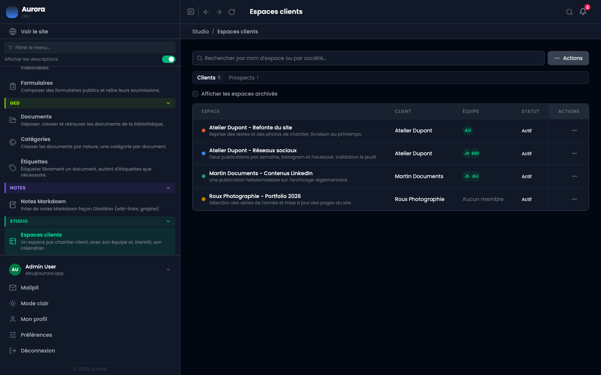
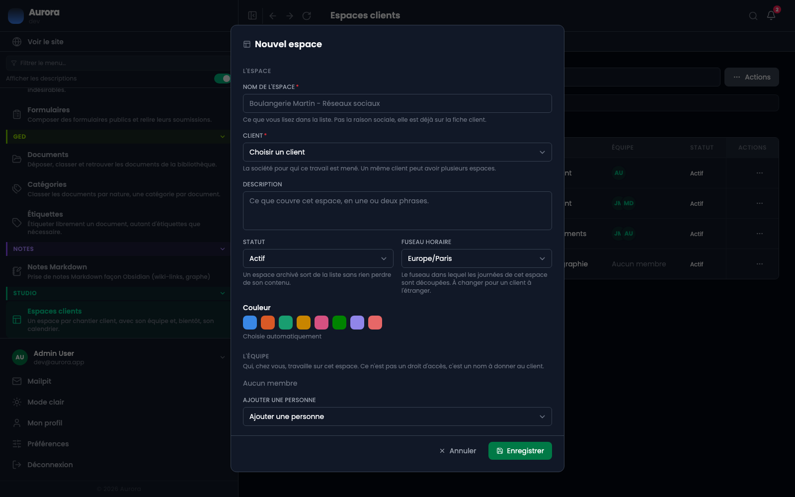
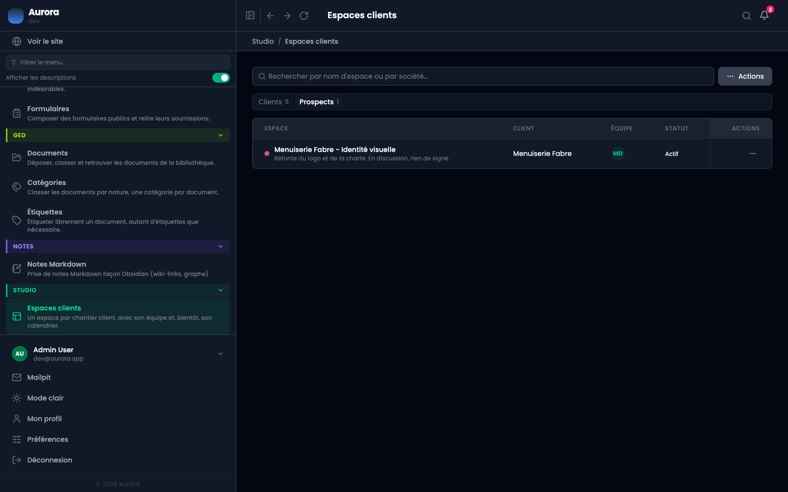
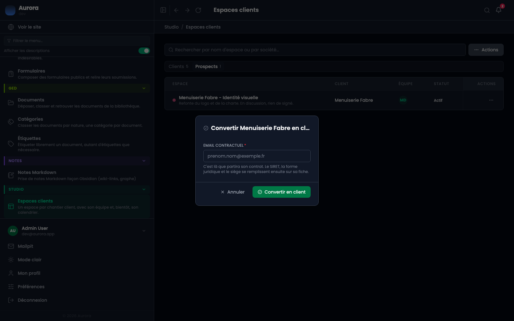
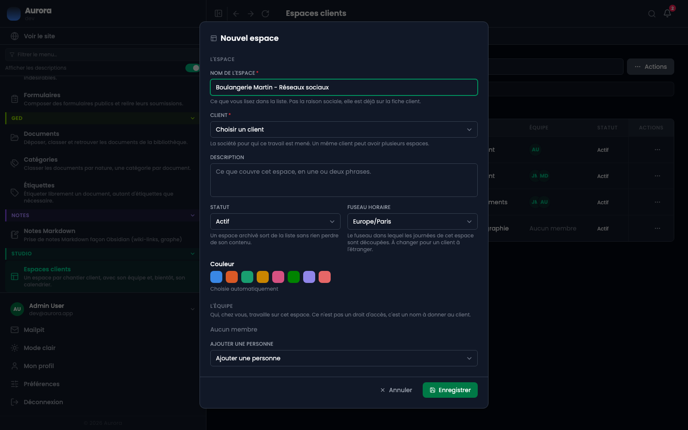
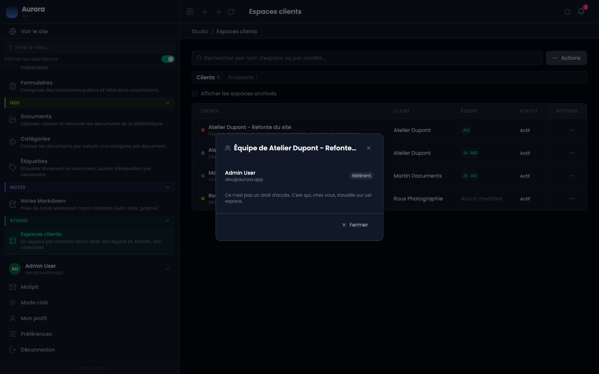

Un espace regroupe le travail mené pour un client : ses publications, son calendrier, et bientôt ses fichiers. C'est l'endroit où l'on passe l'heure de travail, pas un écran que l'on traverse.

## Un chantier, pas une société

**Un client peut avoir plusieurs espaces.** Un client avec deux marques fait tourner deux calendriers ; un client qui signe pour un site puis pour du social a deux chantiers de rythmes différents. Créez-en un par chantier, pas un par société.

La fiche du client, elle, reste unique : l'espace pointe dessus et ne recopie rien.

## 1. Ouvrir la liste

Studio → Espaces clients. Elle est au-dessus des Clients dans le menu, parce qu'un espace s'ouvre tous les jours là où une identité légale se remplit une fois.

## 2. Créer l'espace

« Ajouter un espace » est dans le menu « Actions ». La fenêtre demande peu : un nom, un client, et le reste est facultatif.

- Le **nom** est ce que vous lirez dans la liste. « Boulangerie Martin - Réseaux sociaux », pas la raison sociale : elle est déjà sur la fiche client.
- Le **client** est la société pour qui ce travail est mené. C'est le seul champ obligatoire avec le nom.
- La **couleur** distingue cet espace partout où ses dates apparaissent, y compris dans le calendrier de l'équipe. Laissée vide, elle est choisie pour vous, en évitant celles déjà prises.
- Le **fuseau horaire** découpe les journées de cet espace. À changer pour un client à l'étranger : « mardi 9h » est une promesse faite à quelqu'un, et elle ne doit pas bouger selon qui ouvre la page.

## Pour un prospect, sans attendre d'en savoir plus

On travaille avec une société bien avant d'avoir son SIRET. Plutôt que d'aller inventer une identité légale sur la fiche client pour pouvoir ouvrir l'espace, choisissez **« + Nouveau prospect »** dans la liste des clients : deux champs apparaissent, le nom de la société et, si vous l'avez, une adresse de contact.

**Un nom suffit.** Tout le reste — l'adresse, la forme juridique, le siège, le représentant, le SIRET — attend. Les liens d'accès que vous créerez portent chacun leur propre destinataire, donc l'espace fonctionne entièrement sans que la fiche ait une adresse.

L'espace s'ouvre avec une vraie fiche derrière lui. **Les deux listes se séparent en deux onglets**, Clients et Prospects : celle des espaces, parce que « ce sur quoi je travaille » et « ce que j'essaie de décrocher » ne se lisent pas dans la même minute, et celle des clients pour la même raison. Le compte porté par chaque onglet est ce qui rend l'autre visible.

Quand il signe, **« Convertir en client » est dans le menu Actions de l'espace** — pas besoin d'aller chercher sa fiche, c'est ici qu'on voit le chantier avancer. Une fenêtre demande **une seule chose, l'adresse contractuelle**, parce que c'est le seul champ que le statut impose : c'est là que part son contrat. Le SIRET, la forme juridique et le siège se remplissent ensuite sur sa fiche, quand on les a.

L'espace bascule aussitôt dans l'onglet Clients. Rien ne déménage : son tableau, ses fichiers et ses échanges étaient déjà les siens.

Le même bouton existe sur la fiche du client, pour qui part de là.

Rien n'est interdit à un prospect, pas même un contrat — signer, c'est justement ce qui le convertit.

## 3. L'équipe

Qui, chez vous, travaille sur cet espace. **Ce n'est pas un droit d'accès** : qui peut ouvrir un espace est décidé par les privilèges du compte, comme partout ailleurs. C'est un nom à donner au client.

Dans la liste, l'équipe se lit en visages. Cliquer dessus ouvre la liste complète avec les rôles et les adresses.

## Archiver plutôt que supprimer

Un espace **archivé** sort de la liste sans rien perdre : son contenu, ses échanges et ses liens restent. Le filtre qui les ramène n'apparaît que lorsqu'il y a quelque chose derrière.

Supprimer, au contraire, emporte tout ce que l'espace contenait. Le client, ses contrats et ses documents ne bougent pas.

## Ce que l'écran refuse

Supprimer un **client** qui a encore un espace ouvert est refusé, avec le nombre d'espaces en cause. Archivez ou supprimez son travail d'abord.
