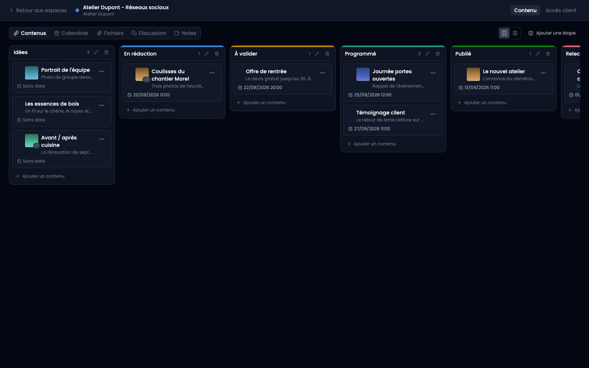
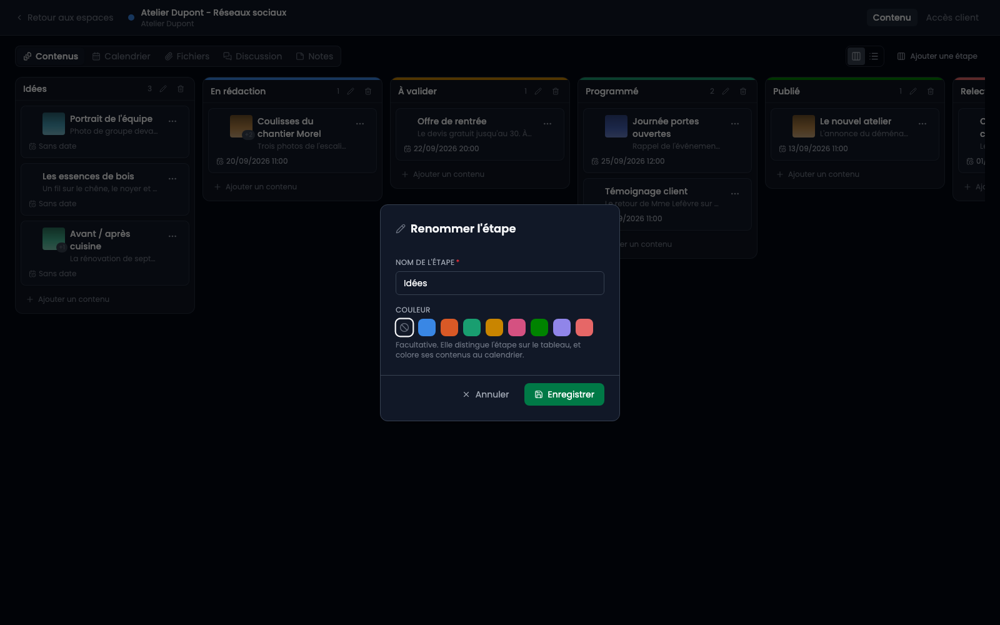
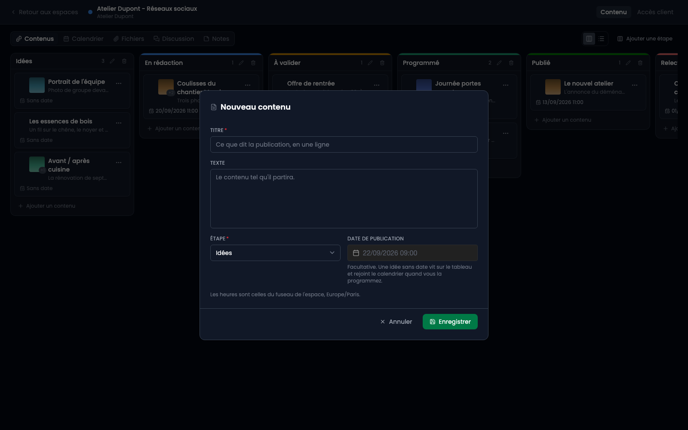
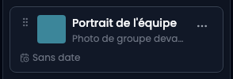

Cliquer sur le nom d'un espace ouvre son contenu. L'écran change : plus de menu latéral, un bandeau fin avec le retour, le nom de l'espace et deux onglets. C'est voulu, un espace est un endroit où l'on reste.

## Cinq questions sur un espace

L'onglet Contenu porte un sélecteur : **Contenus**, **Calendrier**, **Fichiers**, **Discussion**, **Notes**. Ce ne sont pas cinq écrans qui se ressemblent, ce sont cinq questions différentes sur le même espace. Contenus et Calendrier lisent les mêmes fiches, l'un pour dire où en est chaque chose, l'autre pour dire quand ça sort. Fichiers rassemble tout ce que l'espace a échangé, du plus récent au plus ancien, là où une fiche ne montre que les siens. Discussion est le fil de l'espace lui-même, pour ce qui ne tient sur aucune fiche. Notes est votre surface de travail, la seule que le client ne voit pas. Chacun a sa page.

**Votre choix est retenu.** Celui qui ouvre un espace pour sa discussion la retrouve en ouvrant le suivant.

## Deux formes pour les mêmes fiches

En haut à droite de l'onglet Contenus, deux boutons : le **kanban** et la **liste**. Ce ne sont pas deux vues, c'est le même contenu dessiné autrement - mêmes fiches, même ordre, mêmes actions. Le kanban range par étape, la liste se lit de haut en bas et tient sur un téléphone, où des colonnes demanderaient de défiler de côté.

Le choix voyage dans l'adresse de la page, comme celui des fichiers : un lien vers cet écran emmène la forme avec lui. Sur un écran étroit, c'est la liste qui s'affiche quoi qu'en dise le lien, sans effacer ce que vous aviez choisi.

Cette page décrit l'onglet Contenus ; le calendrier, les fichiers, la discussion et les notes ont les leurs.

## Les étapes appartiennent à l'espace

Un nouvel espace arrive avec cinq étapes : Idées, En rédaction, À valider, Programmé, Publié. Elles sont **à vous** : renommez-les, ajoutez-en, supprimez-en.

Un client dont les publications passent par un avocat a une étape que personne d'autre n'a. C'est la raison pour laquelle elles ne sont pas figées.

La **couleur** est facultative, et « aucune » est une vraie réponse : un tableau où chaque étape est colorée est un tableau où la couleur ne veut plus rien dire. Elle sert surtout au calendrier, où une carte porte la couleur de son étape.

## Un contenu

« Ajouter un contenu », en bas d'une étape, ouvre la fenêtre déjà rangée dans cette étape.

- Le **titre** est ce que vous lirez sur la carte.
- Le **texte** est le contenu tel qu'il partira.
- La **date de publication** est **facultative**. C'est le point important : une idée sans date vit sur le tableau et rejoint le calendrier le jour où vous la programmez.
- Les heures sont celles du fuseau de l'espace, rappelé sous le champ.

## Déplacer

Une carte se prend par sa poignée, à gauche, et se dépose dans une autre étape. La poignée n'apparaît qu'au survol : un glissement qui commence sur le corps de la carte entrerait en concurrence avec le clic qui l'ouvre.

## Ce que l'écran refuse

Une **étape qui contient des cartes ne se supprime pas**. Le refus dit combien il y en a, pour que « déplacez-les d'abord » soit une phrase actionnable. Et un tableau garde toujours au moins une étape.
