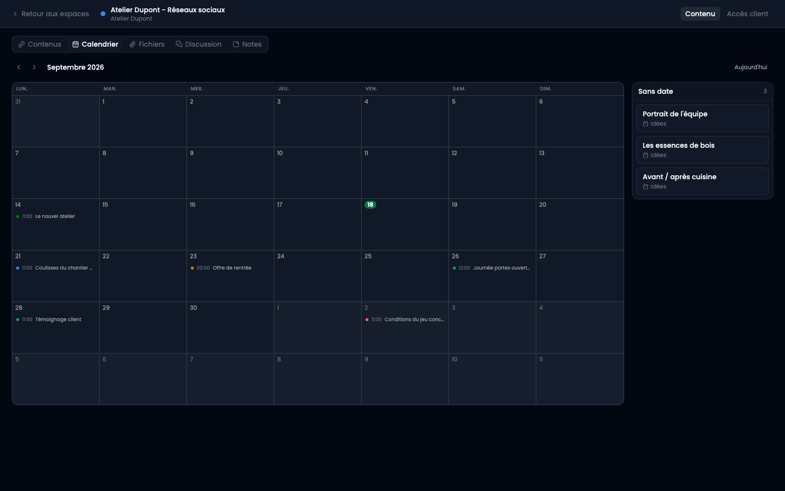

La vue Calendrier, dans l'onglet Contenu, montre **les mêmes contenus que le tableau**, rangés par leur date. Ce ne sont pas deux fonctionnalités : l'étape dit où en est un contenu, la date dit quand il sort, et il n'y a qu'une seule fiche derrière.

C'est ce qui fait qu'il n'y a rien à tenir en accord, et rien à saisir deux fois.

## La colonne « Sans date »

À droite, les contenus qui n'ont pas encore de date. C'est la moitié qu'un calendrier cache d'habitude : le travail qui attend d'être programmé. Un mois qui ne montrerait que la moitié programmée dirait qu'une semaine est vide alors qu'il y a six idées à y placer.

## Les couleurs

Une carte porte la couleur de **son étape**, pas celle de l'espace. À l'intérieur d'un espace, toutes les cartes sont du même client ; ce qu'on parcourt un mois pour voir, c'est ce qui attend encore une validation.

## Déplacer une date

Glisser une carte d'un jour à l'autre la reprogramme. L'heure ne bouge pas : seul le jour change.

Cliquer un jour vide ouvre un contenu déjà daté de ce jour-là. Cliquer une carte l'ouvre.

## Dans le calendrier de l'équipe

Les dates d'un espace remontent automatiquement dans le module Calendrier, sans double saisie. **Un seul calendrier pour tous les espaces**, où chaque client se distingue par sa couleur, et non un calendrier par client qui remplirait la barre latérale de tout le monde.

Ces entrées ne s'y modifient pas : elles sont le reflet de ce que dit l'espace, et la prochaine modification ici les réécrit.

Une fiche dont « afficher dans le calendrier » est décoché n'y remonte pas non plus : les deux calendriers disent la même chose, sans quoi l'un d'eux mentirait.
