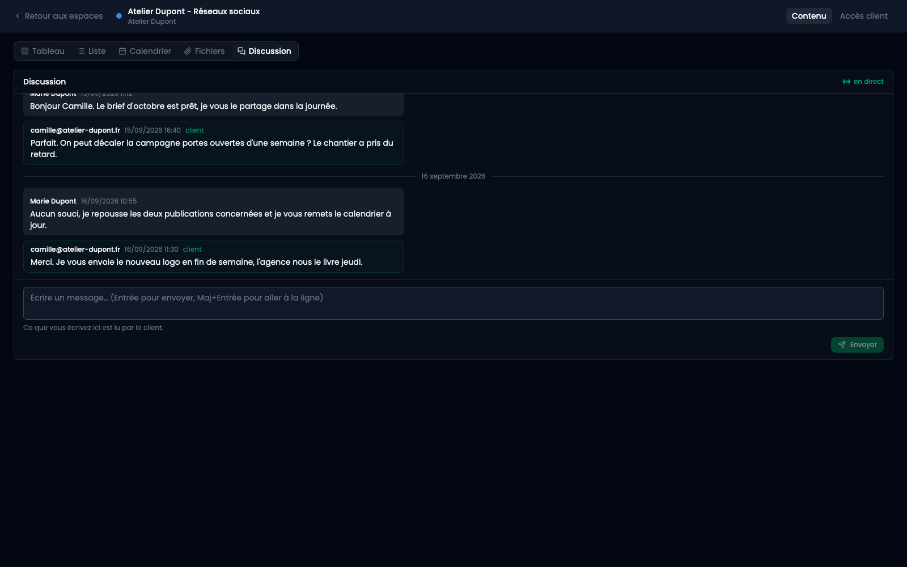
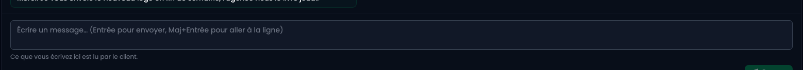

Chaque fiche a déjà ses échanges, et c'est là que doit rester ce qui porte sur un contenu précis : une objection écrite à côté du texte qu'elle vise se retrouve un mois plus tard. **La discussion sert à tout le reste** : le brief du mois, une campagne qui se décale, « qui m'envoie le logo ». Avant, ça atterrissait sur la fiche qui se trouvait ouverte, et ça devenait introuvable.

## 1. Où elle se trouve

Dans le sélecteur de vues, à côté de Tableau, Liste, Calendrier et Fichiers : **Discussion**. Côté client, elle est sous le calendrier de sa page, sans compte à créer.

**Un seul fil, lu des deux côtés.** Ce que vous écrivez là, le client le lit ; la phrase sous la zone de saisie le dit.

 Il n'y a pas de côté interne, volontairement : une case qu'on oublie une fois est pire que pas de case du tout. Ce qui doit rester entre vous n'a rien à faire dans un espace client.

**Entrée envoie, Maj+Entrée va à la ligne**, comme partout ailleurs.

## 2. Qui a le droit d'écrire

Le droit d'écrire dans la discussion est celui de commenter, porté par le lien d'accès : un client qui peut vous répondre sur une publication peut vous répondre tout court. Un lien en lecture seule voit la discussion et n'a pas de zone de saisie.

## 3. En direct, ou pas

Quand un hub est installé sur le serveur, les messages arrivent sans recharger et un voyant **en direct** le dit. S'il tombe, le voyant passe à **reconnexion** et la page interroge le serveur toutes les vingt secondes : rien n'est perdu, tout arrive avec un peu de retard.

**Sans hub, tout fonctionne quand même.** Les messages sont enregistrés et envoyés normalement, ils arrivent au rafraîchissement. Le temps réel est un confort posé par-dessus, pas la base.

## 4. Ce que vous ne pouvez pas supprimer

Vous retirez vos propres messages. **Pas ceux du client** : ce qu'il a écrit est ce qu'il vous a demandé, et un prestataire capable d'effacer une réclamation tient un historique qui ne prouve rien.

## 5. Vous êtes prévenu

Un client qui écrit, commente, valide ou dépose un fichier déclenche une notification pour **les membres de l'espace**. Un espace sans membre ne prévient personne : s'ajouter à un espace, c'est s'y abonner.

**Une notification, pas une par message.** Trois messages d'affilée font une seule ligne tant que vous ne l'avez pas lue. Un avis fait exception et n'est jamais replié : répondre deux fois, c'est changer d'avis, et c'est justement ce qu'il faut voir.

**Et un email, si vous n'êtes pas là.** Cinq minutes après, on regarde à nouveau : si vous avez lu entre-temps, rien ne part. Sinon un seul email, qui liste ce qui s'est passé, et plus rien tant que vous n'avez pas ouvert l'espace.
