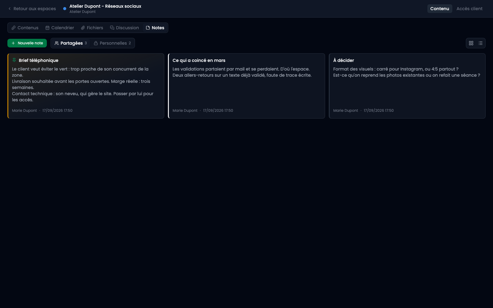
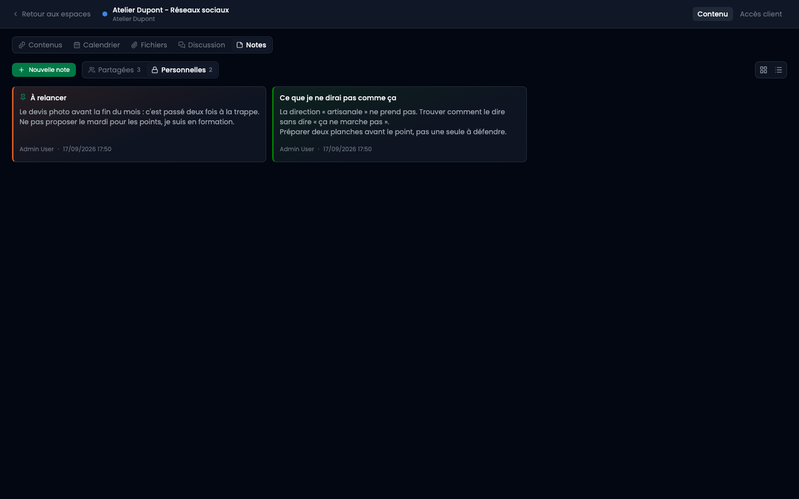
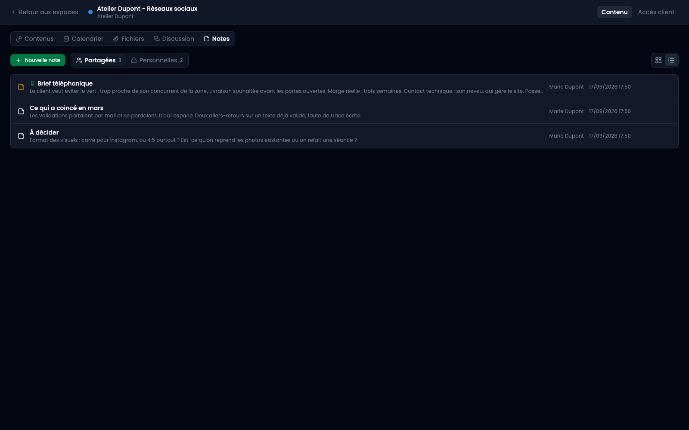
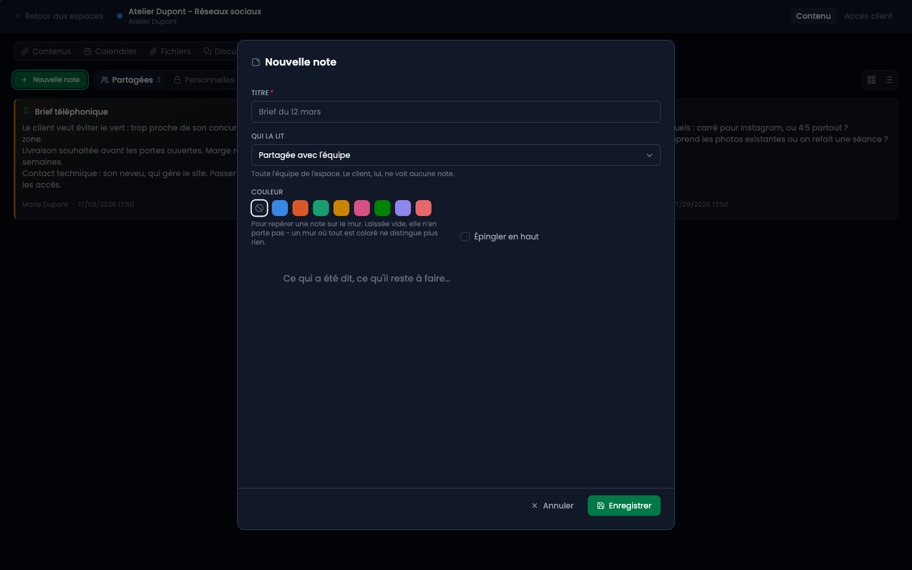

Le fil d'une fiche et la discussion sont **partagés avec le client** : ce que vous y écrivez, il le lit, et les écrans le disent là où l'on tape. Les notes sont l'autre moitié — le brief pris au téléphone, l'idée pas encore présentable, ce qui a mal tourné le mois dernier.

**Le client ne les voit pas.** Sa page ne reçoit rien d'elles, et le module n'a aucune adresse publique pour les servir. C'est cette absence qui permet d'y écrire ce qu'on n'écrirait pas ailleurs.

## 1. Où elles se trouvent

Dans le sélecteur de vues, après Discussion : **Notes**.

## 2. Partagées ou personnelles

Deux onglets, et ils ne parlent pas du client : aucune note ne lui est montrée, dans un onglet comme dans l'autre. Ce qui se sépare ici, c'est **l'équipe et la personne**.

- **Partagée** : toute l'équipe de l'espace la lit. C'est la mémoire de l'espace, ce qu'il faut savoir sur ce client et qu'aucun formulaire ne porte.
- **Personnelle** : vous seul. Elle ne remonte à personne d'autre, pas même à l'équipe.

**« Personnelle » n'est pas un affichage.** Une note personnelle n'est pas cachée derrière un onglet : elle ne sort pas du serveur pour quelqu'un d'autre que son auteur. Les onglets trient ce qui vous est déjà destiné, ils ne filtrent pas ce qui vous serait accessible autrement.

Le choix se fait dans la fenêtre d'écriture, juste sous le titre, et il se change à tout moment. **Partagée par défaut** : une note prise sur l'espace d'un client parle en général du travail, et un mur que personne d'autre ne peut lire cesse d'être la mémoire de l'espace. L'onglet ouvert décide de ce que sera la prochaine note, parce qu'on écrit là où on regarde.

Le compte porté par chaque onglet est ce qui rend l'autre visible.

## 3. Deux façons de les lire

**Le mur** répond à « qu'est-ce qu'il y a sur cet espace » : chaque note est un post-it, avec son début de texte. **La liste** répond à « où est celle que je cherche ». Ce sont deux lectures de la même chose, dans le même ordre, et le choix reste dans l'adresse de la page.

Les notes **épinglées** passent devant, puis viennent les plus récemment modifiées. L'épingle ne fait que ça : dire « celle-ci compte aujourd'hui ».

## 4. Écrire

Le même éditeur que les publications, avec ses titres, ses listes, ses tableaux et ses images. Rien de propre aux notes : un second éditeur aurait été un second jeu d'habitudes.

La **couleur** sert à repérer une note sur le mur. Laissée vide, la note n'en porte pas — un mur où tout est coloré ne distingue plus rien.

## 5. Où vont les images

C'est la partie qui mérite d'être lue. Une image collée dans une note **ne va pas dans le tas général des images d'édition** : elle est rangée dans le dossier de cet espace, à côté des fichiers échangés sur ses fiches, et elle est enregistrée **en brouillon**.

Ce que ça change, concrètement :

- Elle n'a **aucune adresse publique** devinable. Une note est la seule chose qu'un client ne voit pas ; ses images ne devaient pas être plus joignables qu'elle.
- Elle apparaît dans la médiathèque, classée sous la catégorie des espaces clients et dans le dossier de celui-ci.
- Elle n'est **pas proposée dans le sélecteur d'images** d'une publication, qui ne liste que les documents publiés. La capture d'un chantier n'est pas du mobilier de site ; si elle doit le devenir, publiez-la depuis la médiathèque.

**La médiathèque sait quelles notes utilisent une image.** L'écran de suppression le dit avant que vous ne supprimiez : sans ça, retirer une image viderait une note en silence — et une note vidée a toujours l'air entière, ce qui est pire que cassée.

Les notes personnelles des autres comptent dans cette réponse, mais ne s'y nomment pas : l'écran dit « la note personnelle de quelqu'un », ce qui suffit à refuser la suppression sans dire de quoi elle parle.

## 6. Supprimer

Supprimer une note **ne supprime aucune image**. Celles que plus rien n'utilise vous sont proposées, avec un bouton pour les mettre à la corbeille — proposées, pas jetées : elles peuvent servir ailleurs, et c'est une décision qui vous appartient.
