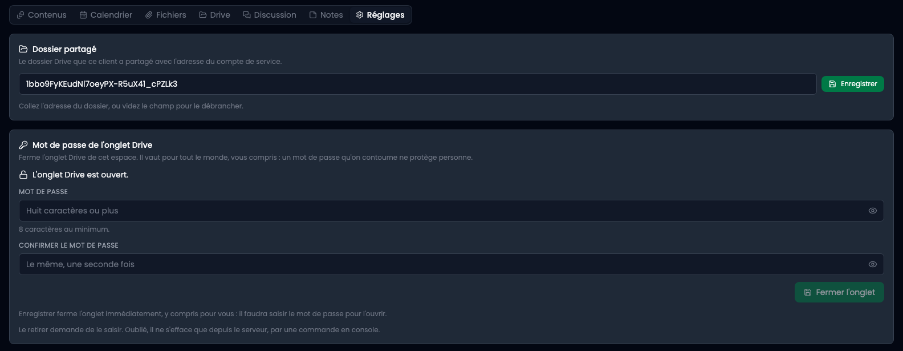
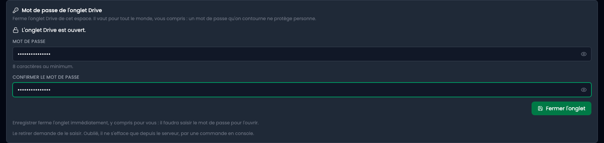
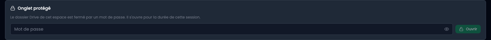

Tout ce qui se décide une fois pour un espace vit dans son dernier onglet : **Réglages**. Le dossier Drive que ce client a partagé, et le mot de passe qui ferme cet onglet.

**Seul le référent de l'espace y entre.** Un équipier, lui, ne voit pas l'onglet : il écrit, commente et programme comme avant, mais ne change pas la configuration de l'espace. Le rôle de référent, qui ne disait jusqu'ici qu'à qui s'adresser, ouvre maintenant une porte.



## 1. Le dossier partagé

Collez l'adresse du dossier telle que Drive l'affiche dans la barre du navigateur. L'identifiant nu est accepté aussi, mais rien n'oblige à aller le chercher : l'écran découpe l'adresse.

Vider le champ débranche le dossier. Cela ne supprime rien chez le client et ne touche pas au partage.

La configuration du compte de service, elle, est commune à tous les espaces et se fait une seule fois : voir [Dossier Google Drive](/backend/documentation/dossier-google-drive).

## 2. Fermer l'onglet Drive par un mot de passe

Un dossier partagé contient parfois des pièces qu'on ne veut pas laisser à portée d'un écran resté ouvert. Un mot de passe referme l'onglet Drive de cet espace, et de celui-là seulement.



Huit caractères au minimum, saisis deux fois. Le petit œil au bout du champ montre ce que vous tapez, parce qu'une faute de frappe ici ferme une porte dont plus personne n'a la clé.

**Il vaut pour tout le monde, vous compris.** Enregistrer ferme l'onglet immédiatement, y compris dans votre propre session : il faudra le saisir pour l'ouvrir. Ce n'est pas un oubli, c'est ce qui permet de voir que la porte s'est fermée, et un mot de passe que celui qui l'a posé contourne ne protège de personne.

Le rôle le plus élevé ne le contourne pas non plus.

## 3. Ce que voit quelqu'un qui arrive

L'onglet Drive reste visible, et demande le mot de passe. Le saisir l'ouvre **pour la durée de cette session** : se refermer avec le navigateur est ce qu'on attend d'une serrure.



Configurer n'est pas ouvrir : un équipier qui n'a pas accès aux réglages ouvre malgré tout l'onglet s'il connaît le mot de passe. C'est exactement ce qu'un mot de passe veut dire.

## 4. Les trois boutons

**Changer le mot de passe** demande l'ancien. Sans cela, un écran laissé ouvert suffirait à le remplacer, et la serrure ne vaudrait que jusqu'à la prochaine pause café. Ceux qui étaient entrés avec l'ancien sont refermés dehors.

**Redemander le mot de passe** referme toutes les sessions ouvertes, la vôtre comprise, **sans rien changer**. C'est la réponse au doute ordinaire : un écran resté ouvert ailleurs, quelqu'un à qui on a montré l'onglet : ceux qui le connaissent le retapent, et vous n'avez de nouveau mot de passe à communiquer à personne.

**Rouvrir l'onglet** retire le mot de passe pour de bon, et demande de le saisir. Le prix de cette exigence est qu'un oubli bloque.

## 5. Si le mot de passe est perdu

Il n'est enregistré nulle part en clair et ne peut pas être relu, pas même depuis la base. La seule issue est une commande sur le serveur, dont l'aide en ligne donne la formulation exacte :

```
bin/console list aurora:space
```

Elle rouvre l'onglet et referme au passage les sessions en cours. L'autorité qui débloque est donc l'accès à la machine, ce qui est un vrai niveau d'autorité et pas une case à cocher.
