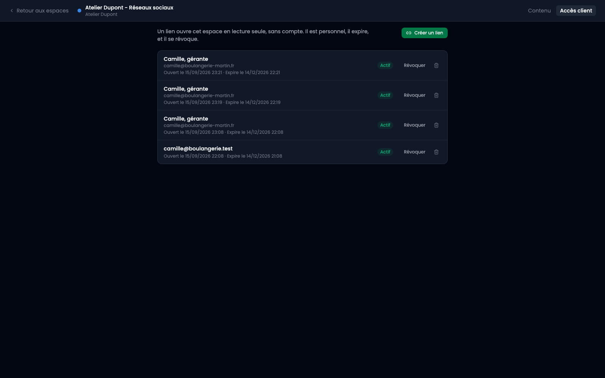
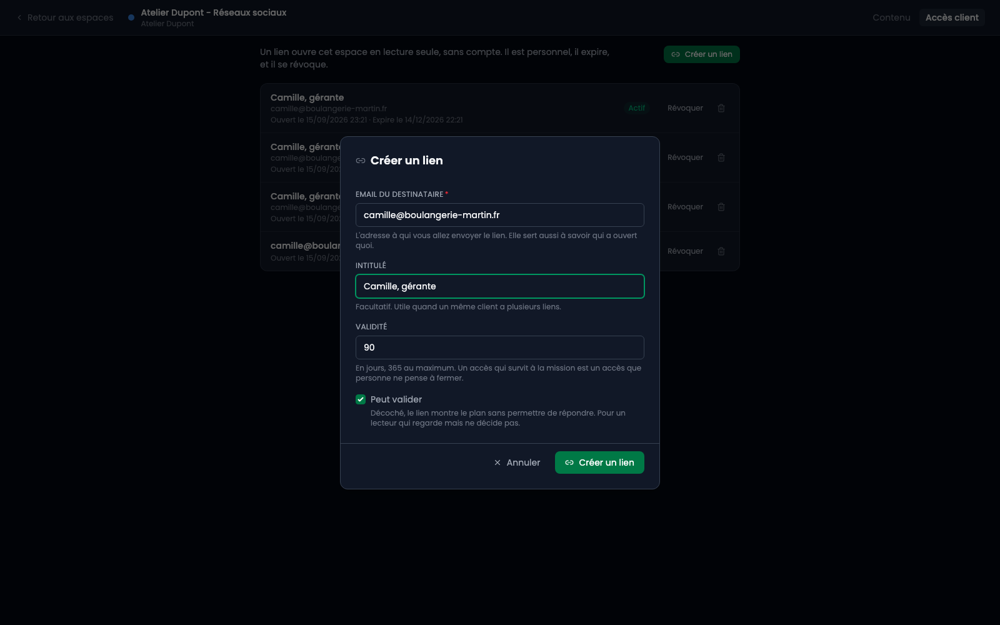
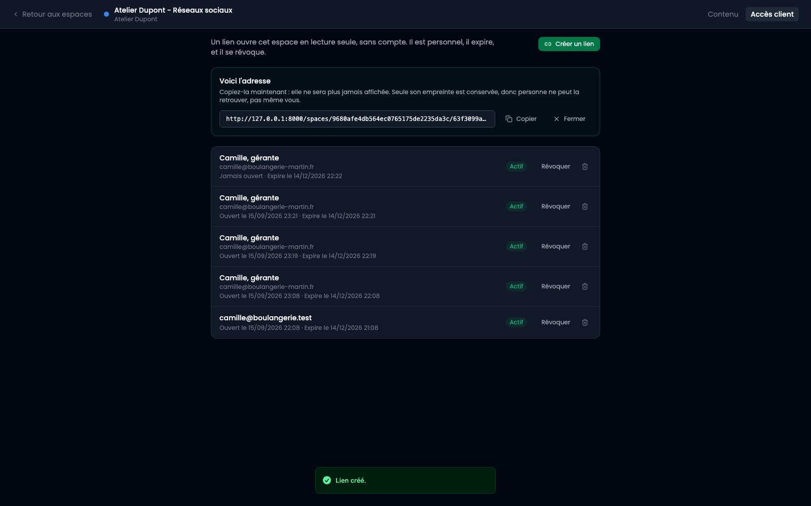
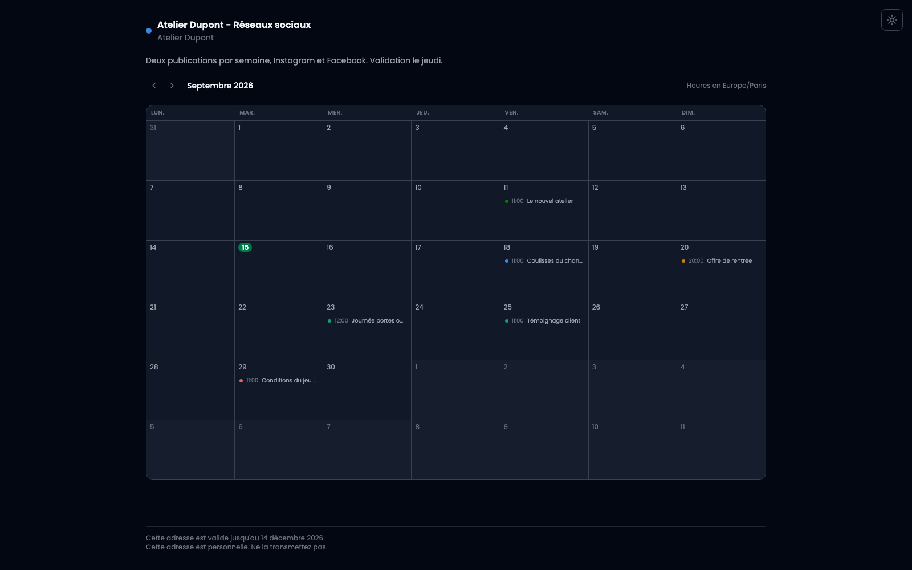
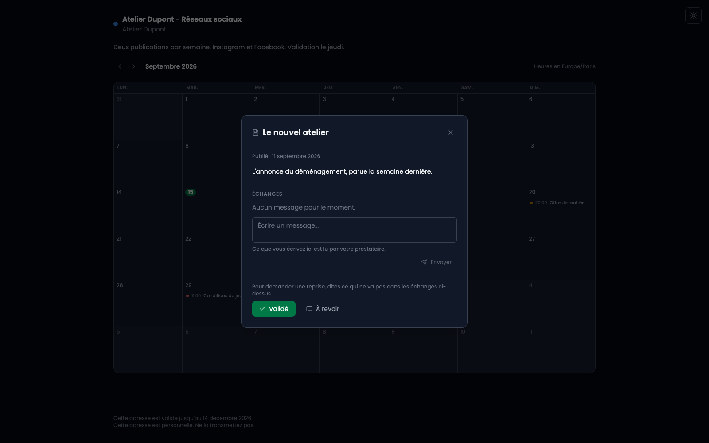
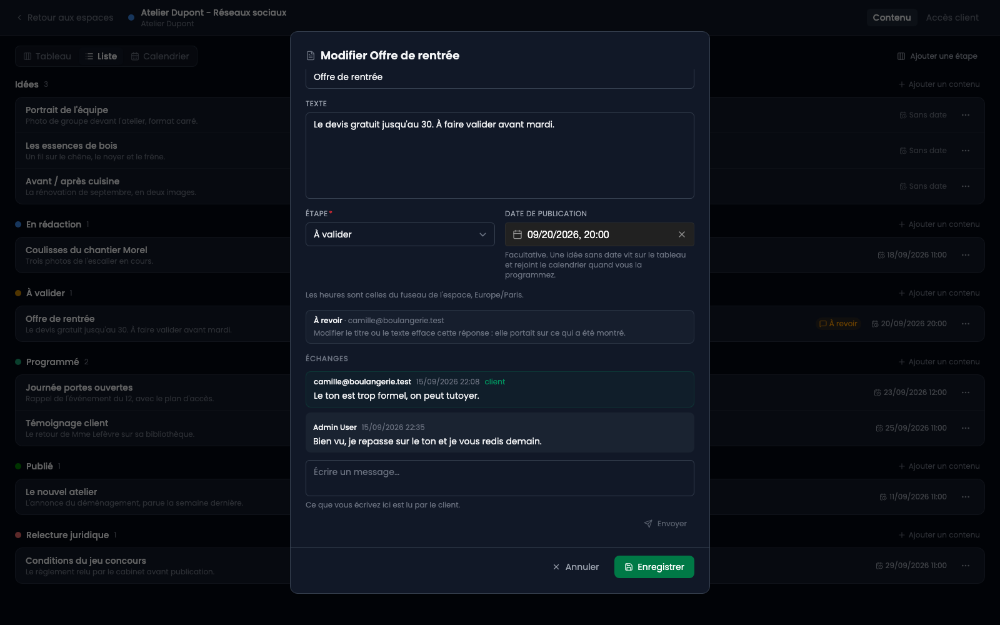
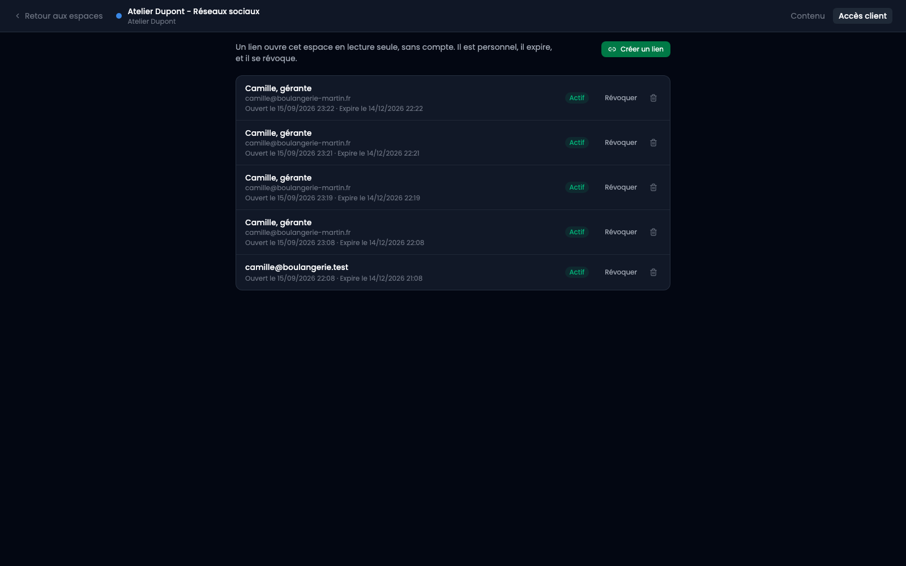

Un client peut voir son plan de contenu sans avoir de compte. Vous lui envoyez une adresse, il ouvre son mois, il répond.

## 1. Créer le lien

Onglet « Accès client », puis « Créer un lien ».

- L'**email du destinataire** est l'adresse à qui vous enverrez le lien. Elle sert aussi à savoir qui a ouvert quoi et qui a répondu quoi.
- L'**intitulé** est facultatif, utile quand un même client a plusieurs liens.
- La **validité** est de 90 jours par défaut, un an au maximum. Un accès qui survit à la mission est un accès que personne ne pense à fermer.
- **Peut commenter** et **peut valider** sont cochés par défaut. Décochez-les pour un lecteur qui regarde sans décider : une agence partenaire, le supérieur du client, un prospect.

## 2. Copier l'adresse maintenant

**Elle n'est affichée qu'une fois.** Seule son empreinte est conservée, donc personne ne peut la retrouver ensuite, pas même vous. C'est ce qui fait qu'une base volée ne donne pas accès aux espaces.

Si vous la perdez, révoquez le lien et créez-en un autre.

## 3. Ce que le client voit

Son mois, ses publications aux jours prévus, et le texte de chacune en cliquant. Pas de menu, pas de compte, rien à installer.

## 4. Ce qu'il vous répond

En ouvrant une publication : **Validé** ou **À revoir**. La réponse apparaît en badge sur la carte de votre tableau.

**La réponse ne déplace jamais la carte.** C'est un avis, pas un automatisme : un client qui clique par erreur aurait sinon programmé une publication. Le tableau montre la réponse, vous déplacez.

## 5. Les échanges

Au-dessus des deux boutons, un fil partagé : ce que vous écrivez, le client le lit, et inversement. C'est là que se dit le pourquoi d'une reprise.

**Rien n'y est interne.** Une note destinée à un collègue écrite dans cette zone est une note que le client lit.

Vous pouvez supprimer vos propres messages, pas ceux du client : c'est ce qu'il vous a demandé d'appliquer.

## Modifier le texte efface la validation

Une validation porte sur une formulation. Si vous réécrivez le titre ou le texte, elle repasse en attente, parce qu'elle ne prouverait plus rien.

**Les échanges, eux, restent.** C'est justement ce que le client a demandé, et vous en avez besoin pendant que vous corrigez.

## Révoquer ou supprimer

**Révoquer** ferme l'adresse et garde la trace : qui l'a reçue, quand elle a été ouverte. C'est ce que l'on veut dans la plupart des cas.

**Supprimer** efface aussi la trace. C'est pour le lien envoyé à la mauvaise adresse trente secondes plus tôt.

Un lien révoqué, expiré ou inconnu rend la même page au visiteur : « Ce lien n'est plus valide ». Les distinguer dirait à un inconnu laquelle de ses tentatives a porté.
