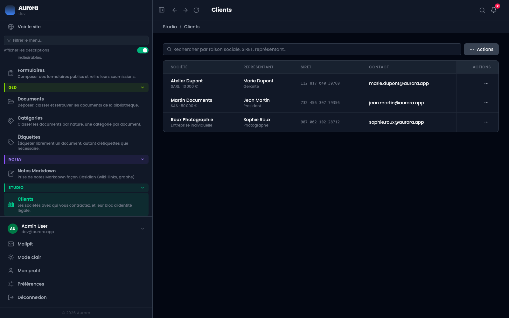
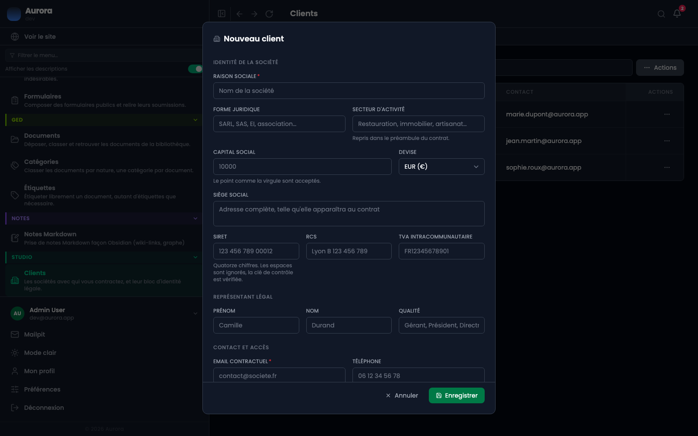
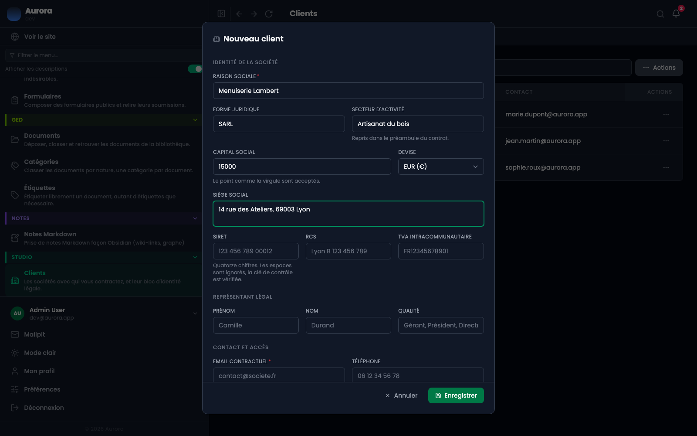
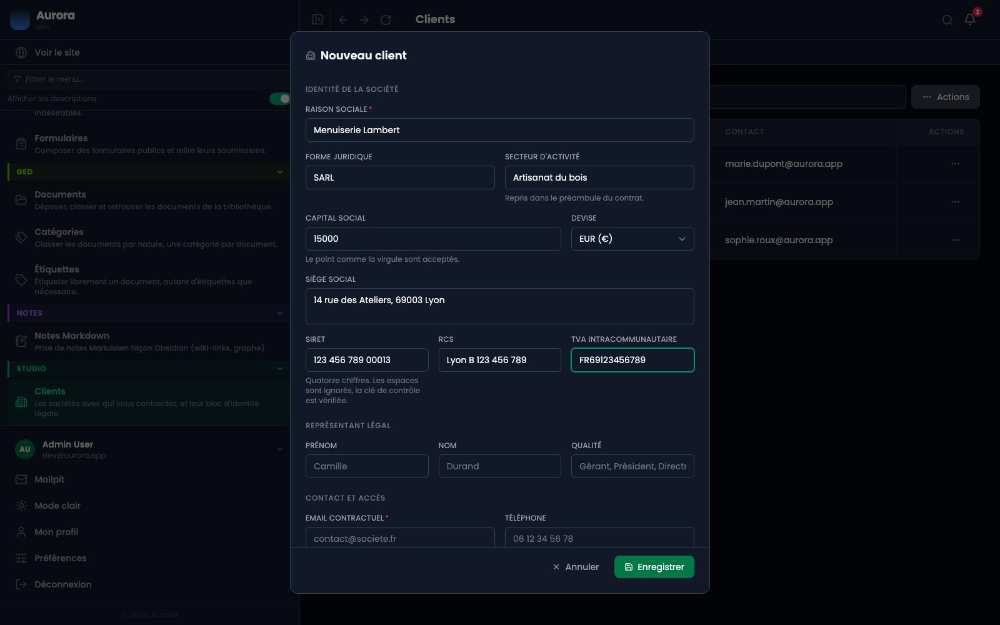
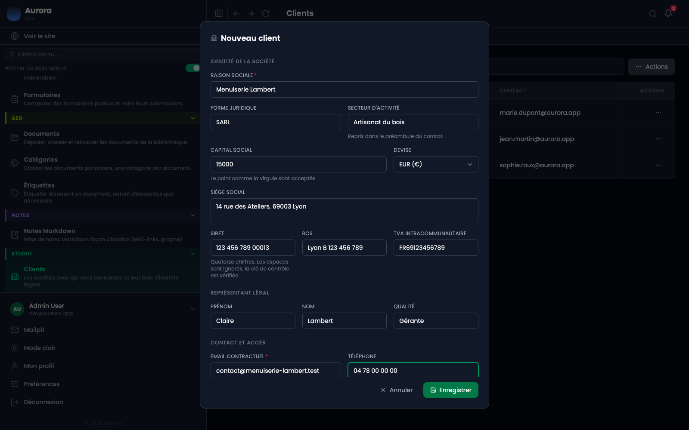
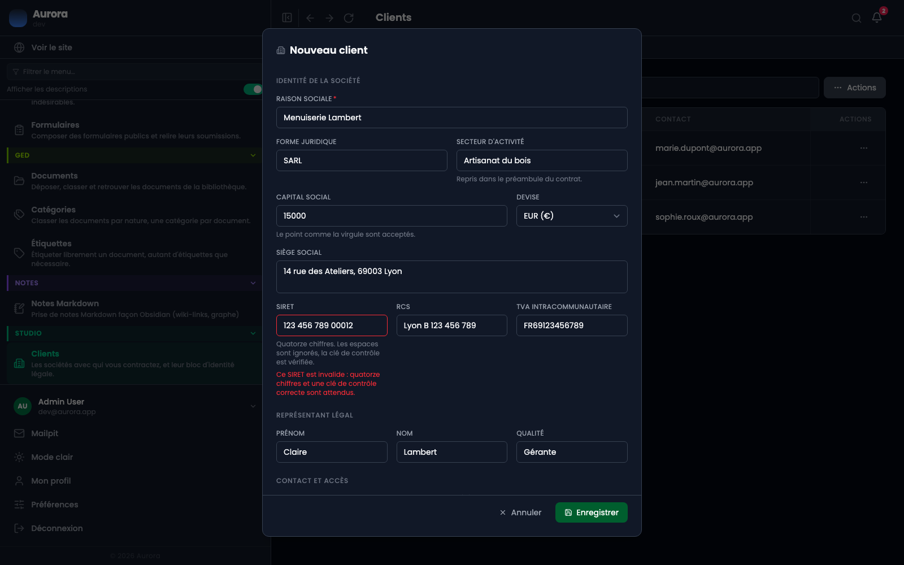

Un client est une société avec laquelle vous contractez. Sa fiche porte tout ce que le contrat recopiera : la raison sociale, le siège, les identifiants, le représentant qui signe.

## Pourquoi c'est si détaillé

Au scellement, ce bloc d'identité est **recopié dans le contrat**. C'est la copie qui fait foi, pas la fiche : corriger l'adresse demain ne changera rien à un contrat déjà scellé. D'où le soin à la remplir avant, plutôt qu'après.

## 1. Ouvrir la liste des clients

Studio → Clients. La recherche porte sur la raison sociale, le SIRET et le représentant. « Ajouter un client » est dans le menu « Actions », en haut à droite.

## 2. La fenêtre s'ouvre en trois blocs

L'identité de la société, le représentant légal, puis le contact et l'accès. Un seul champ est obligatoire dans le premier bloc, la raison sociale, et un seul dans le troisième, l'e-mail contractuel.

## 3. L'identité de la société

- La **raison sociale** est le nom qui apparaîtra au contrat.
- La **forme juridique** et le **secteur d'activité** sont repris dans le préambule.
- Le **capital social** accepte le point comme la virgule.
- Le **siège social** est une adresse complète, telle qu'elle doit apparaître.

## 4. Les identifiants

SIRET, RCS et TVA intracommunautaire. Le SIRET fait quatorze chiffres, les espaces sont ignorés, et **sa clé de contrôle est vérifiée** : une suite de quatorze chiffres au hasard sera refusée.

## 5. Le représentant et le contact

Le représentant légal est la personne qui signera. Sa qualité, gérant, président, directrice, est reprise au contrat.

L'**e-mail contractuel** est celui auquel partira le lien de signature, et celui auquel le code de signature sera envoyé. C'est ce qui en fait une preuve : le code ne va pas à une adresse saisie au moment de signer, mais à celle que porte la fiche.

## Ce que l'écran refuse

Un SIRET dont la clé de contrôle est fausse est refusé sous le champ, avec la raison. C'est le refus le plus fréquent, et le plus utile : une erreur de frappe dans un SIRET ne se voit pas à l'œil.

## 6. Enregistrer

Le client apparaît dans la liste et devient choisissable à la préparation d'un contrat.

## Le rattachement à un compte

Le dernier champ, facultatif, relie la fiche à un compte utilisateur du site. Il ne sert pas à la signature, qui passe par un lien sans compte, mais à retrouver qui est qui quand un client a aussi un accès.
