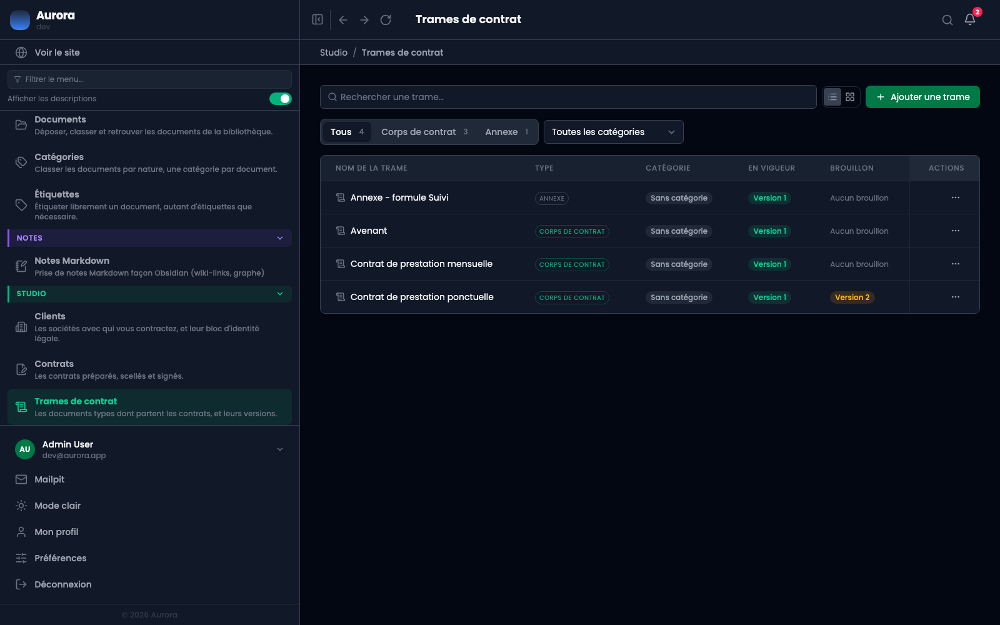
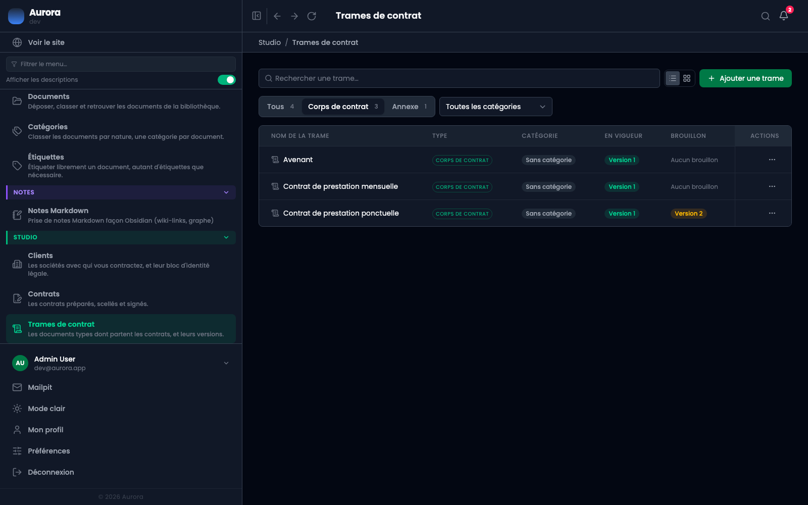
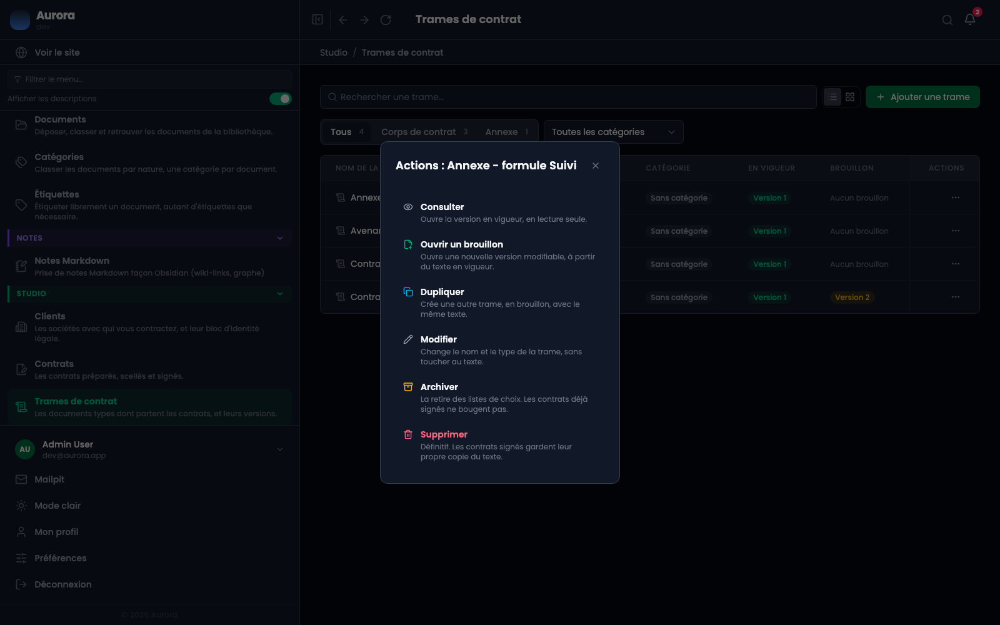
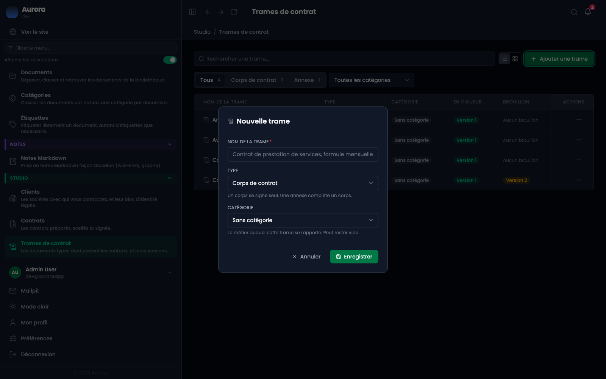

Une trame est un document type. Les contrats en partent, mais n'en dépendent plus une fois scellés : chacun garde sa propre copie du texte.

## 1. La liste

Studio → Trames de contrat. Chaque ligne montre le type, la catégorie, la version **en vigueur** et le **brouillon** en cours s'il y en a un. Une trame sans version publiée ne peut pas servir à préparer un contrat.

## 2. Corps ou annexe

Le filtre sépare les deux types. Un **corps** porte le texte contractuel ; une **annexe** porte ce qui varie d'une offre à l'autre. Un contrat prend un corps, et facultativement une annexe : l'écran de préparation refuse d'inverser les deux.

## 3. La catégorie

Le type dit ce qu'un document **est**, la catégorie dit pour quel métier il **sert**. Les deux ne se remplacent pas : le type décide comment un contrat s'assemble, la catégorie décide ce qui se range ensemble.

Elle devient utile le jour où une activité en devient deux. Sans elle, une bibliothèque qui couvre trois métiers est une suite alphabétique où rien n'est à côté de ce qui lui ressemble, et le sélecteur du contrat propose l'annexe photo pendant qu'on rédige un contrat de site.

Une trame peut n'en avoir aucune, et c'est un état à part entière, pas un oubli à corriger : le filtre propose « Sans catégorie » parce que « qu'est-ce que je n'ai pas encore rangé » est la première question qu'on se pose. À la préparation d'un contrat, les trames sont regroupées par métier et non filtrées : un corps écrit pour une activité est parfois le bon point de départ pour une autre.

## 4. Les six actions

- **Consulter** ouvre la version en vigueur, en lecture seule. C'est un lien : on peut l'ouvrir dans un nouvel onglet et garder sa place dans la liste.
- **Ouvrir un brouillon** crée une nouvelle version modifiable, à partir du texte en vigueur.
- **Dupliquer** crée une autre trame, en brouillon, avec le même texte et la même catégorie.
- **Modifier** change le nom, le type et la catégorie, sans toucher au texte.
- **Archiver** la retire des listes de choix ; les contrats déjà signés ne bougent pas.
- **Supprimer** est définitif, et les contrats signés gardent leur propre copie du texte.

Ces deux dernières phrases sont la clé du modèle : ce qui a été signé ne dépend plus de la trame.

Consulter demande le droit de consultation, pas celui de modification : lire une trame et la réécrire ne sont pas le même droit.

## 5. Créer une trame

Un nom, un type, et une catégorie si le métier est déjà décidé. Le texte s'écrit ensuite, dans la première version, qui naît en brouillon.

