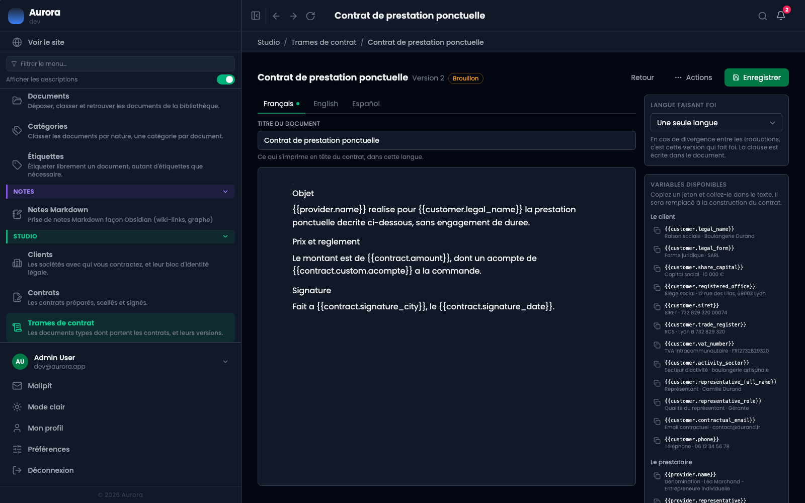
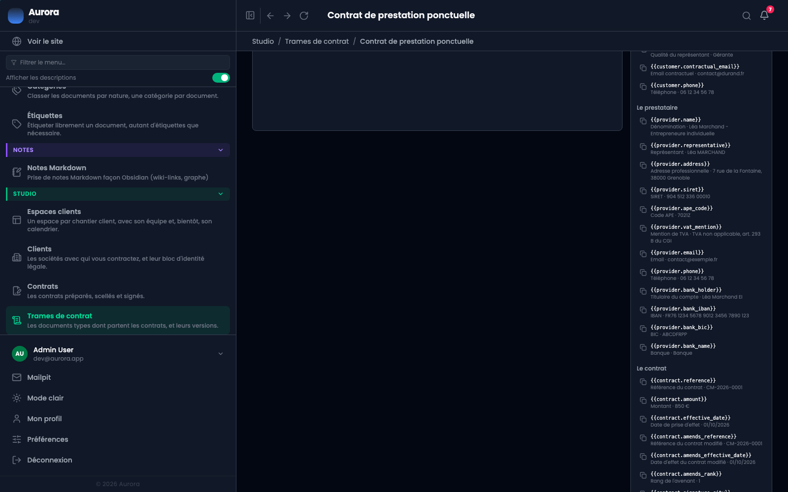
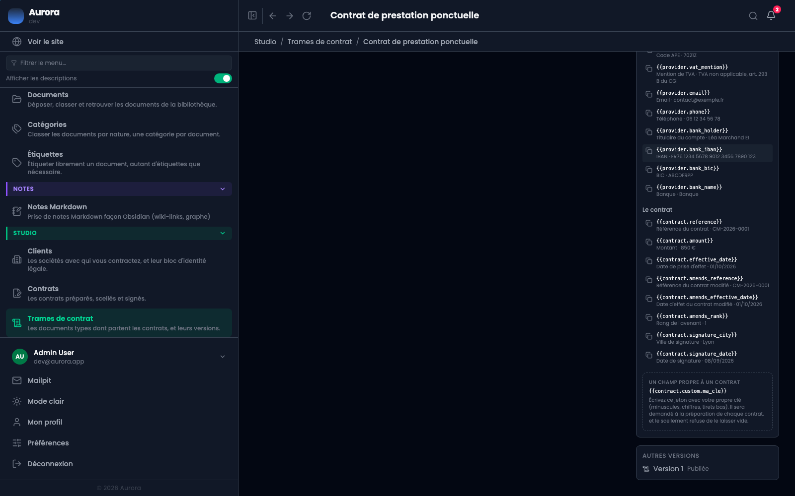

Le texte d'une trame ne se modifie jamais en place. On ouvre une version, on l'écrit, on la publie. Les contrats déjà scellés gardent celle qui était en vigueur ce jour-là.

## 1. L'éditeur

En haut, le numéro de version et son état. À gauche, les onglets de langue : une pastille marque celles qui ont du texte. Puis le titre du document, ce qui s'imprime en tête du contrat dans cette langue, et le corps.

À droite, deux panneaux : la langue faisant foi, et la liste des jetons disponibles.

## 2. Le texte et ses jetons

Le texte s'écrit normalement, avec des jetons entre doubles accolades là où le contrat devra mettre une valeur. Le panneau de droite liste chaque jeton avec un exemple de ce qu'il donnera, et un bouton pour le copier.

## 3. Le bas du panneau

Les jetons du contrat, dont ceux propres aux avenants, puis le **champ propre à un contrat** : un jeton que vous inventez, avec votre propre clé, et qui sera demandé à la préparation de chaque contrat. Le scellement refuse de le laisser vide.

Tout en bas, les autres versions de la trame, avec leur état.

## Aperçu

Écrire un contrat, c'est écrire `{{customer.legal_name}}` et faire confiance. Le bouton **Aperçu** ouvre le document tel que le client le lira, variables remplacées, assemblé exactement comme le scellement l'assemblera.

Les valeurs sont celles que le panneau des variables affiche déjà, donc l'aperçu et le panneau ne peuvent pas se contredire. Sauf celles de votre entreprise, qui sont les vraies : elles viennent des réglages, et un réglage vide se voit à l'endroit exact où le trou apparaîtrait chez le client. Les champs remplis à la création d'un contrat s'affichent entre crochets, parce qu'il n'y a pas d'exemple à donner pour une case qui n'est pas encore répondue.

Le brouillon est enregistré avant l'ouverture : l'aperçu montre ce qui est à l'écran, pas ce qui était en base il y a une heure. Et un bloc que l'aperçu refuse de dessiner est un bloc que le scellement aurait refusé : le rencontrer ici est l'intérêt.

## Enregistrer, publier, abandonner

- **Enregistrer** garde le brouillon sans le mettre en vigueur. Rien ne change pour les contrats.
- **Publier** met cette version en vigueur. À partir de là son texte est immuable, et c'est elle que les nouveaux contrats prendront.
- **Abandonner** jette le brouillon. La version en vigueur reste celle d'avant.

## Ce que la publication refuse

- Une version sans aucune traduction.
- Une version écrite en plusieurs langues sans langue faisant foi : deux documents d'égale autorité et aucun moyen de trancher un désaccord.
