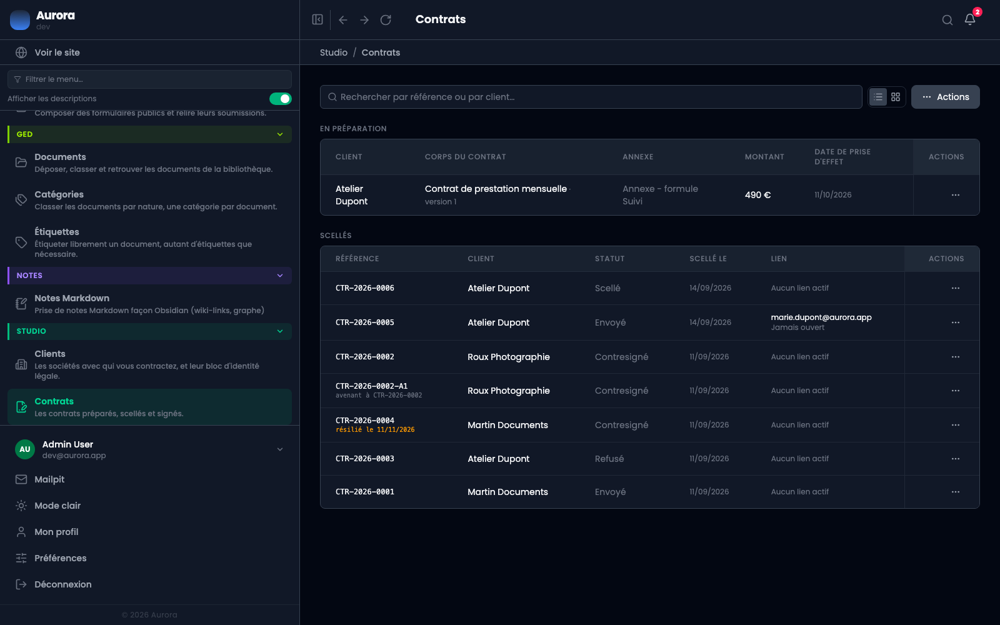
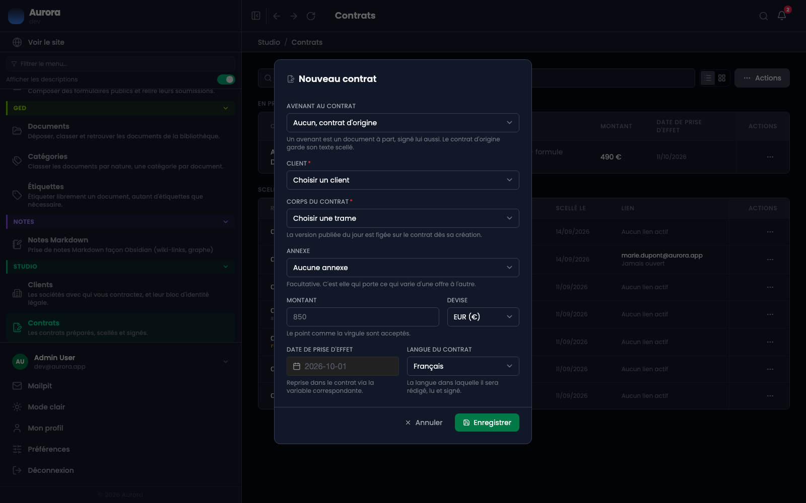
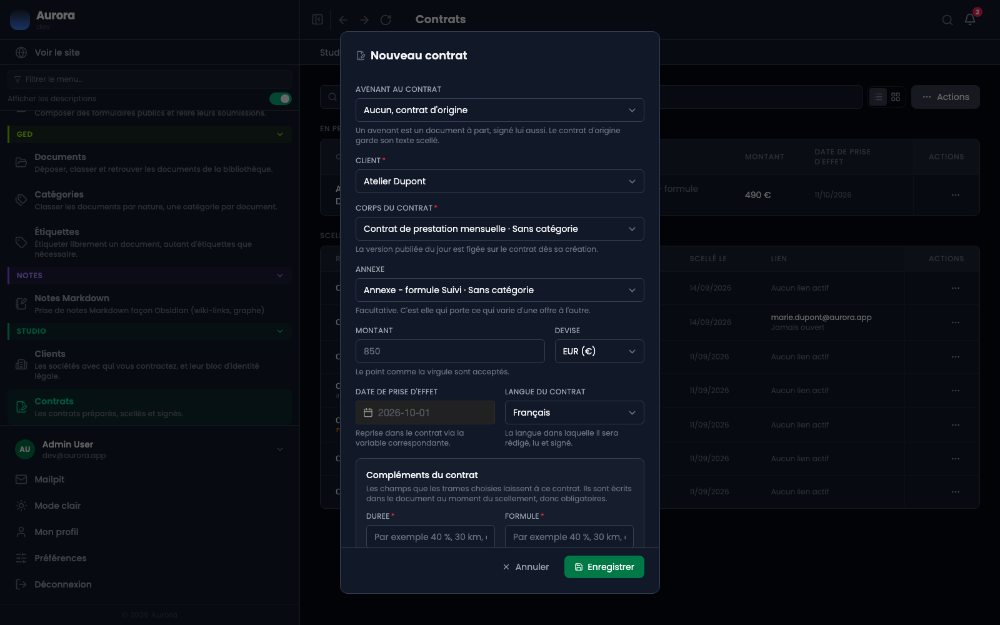
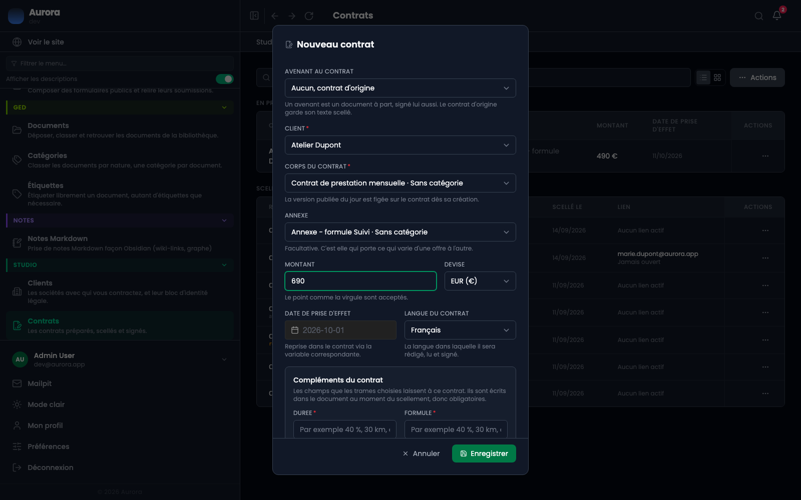
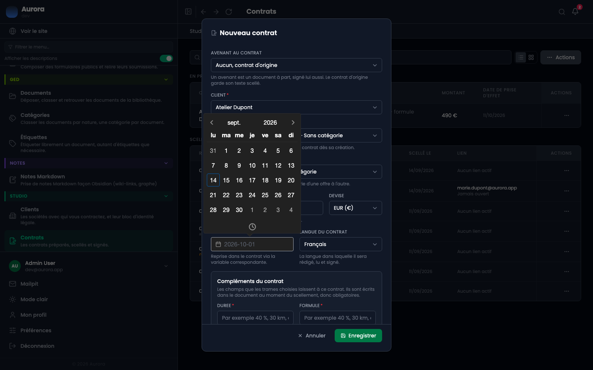
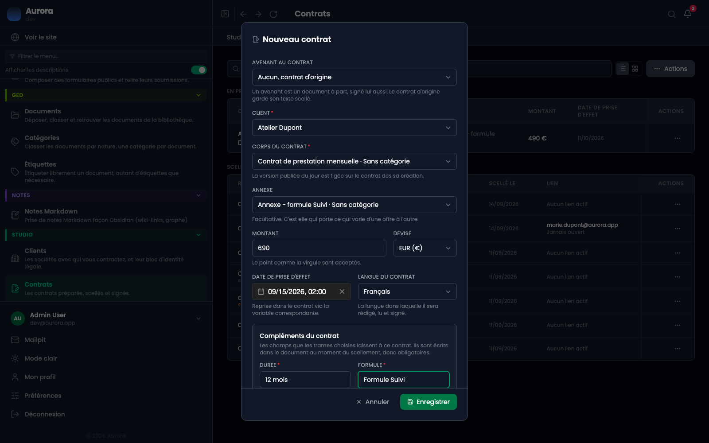
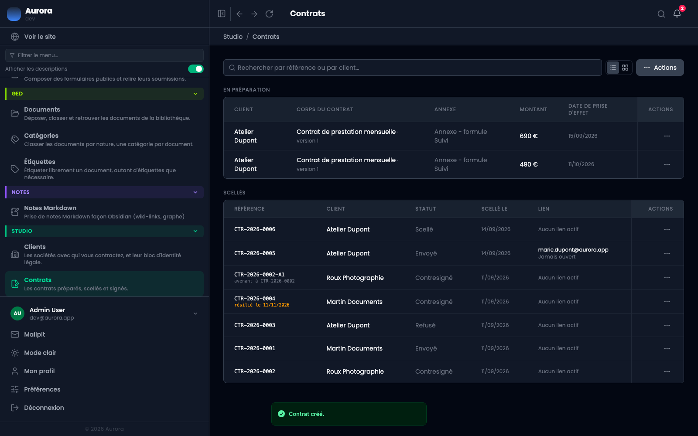

Un contrat se prépare avant d'être scellé. Tant qu'il est en préparation, tout se change : le client, les trames, le montant, la date. Rien n'est figé, et rien n'est parti chez personne.

## Avant de commencer

- Le client doit exister dans Studio → Clients, avec son bloc d'identité complet.
- La trame choisie doit avoir une version publiée. Une trame qui n'en a aucune est refusée ici, pas au scellement.
- Les douze réglages d'identité du prestataire doivent être remplis, sinon le scellement bloquera plus tard.

## 1. Ouvrir la liste des contrats

Studio → Contrats. La liste sépare ce qui est **en préparation**, encore modifiable, de ce qui est **scellé**, définitif. « Préparer un contrat » est dans le menu « Actions », en haut à droite.

## 2. La fenêtre de préparation

Elle s'ouvre vide. Deux champs sont obligatoires, signalés par une astérisque : le client et le corps du contrat.

Le premier champ, « Avenant au contrat », reste sur « Aucun, contrat d'origine ». Il ne sert qu'à modifier un contrat déjà signé, et c'est alors la page des avenants qu'il faut lire.

## 3. Choisir le client

La liste ne propose que les clients existants : on ne crée pas un client depuis ici, volontairement. Son bloc d'identité sera recopié dans le contrat au scellement, et c'est cette copie qui fera foi, pas la fiche.

## 4. Choisir le corps, puis l'annexe

Le corps porte le texte contractuel. L'annexe est facultative et porte ce qui varie d'une offre à l'autre : le périmètre, la formule.

La phrase sous le champ dit l'essentiel : **la version publiée du jour est figée sur le contrat dès sa création**. Publier une nouvelle version de la trame demain ne changera rien à ce contrat-ci.

## 5. Le montant et la devise

Le point comme la virgule sont acceptés. Le montant est repris dans le texte du contrat par le jeton correspondant, et il pourra encore changer tant que le contrat n'est pas scellé.

## 6. La date de prise d'effet

Le clic sur le champ ouvre le calendrier. Vous pouvez aussi taper la date : `15/11/2026`, ou `2026-11-15`, ou même `15112026`, puis Entrée.

La langue du contrat, à droite, décide de la traduction de trame qui sera scellée. C'est la langue dans laquelle il sera rédigé, lu et signé.

## 7. Les compléments demandés par la trame

Une section « Compléments du contrat » apparaît en bas de la fenêtre si les trames choisies laissent des blancs. Ici, une durée et une formule.

Ils sont **obligatoires** : ces blancs sont écrits dans le document au moment du scellement, et un contrat scellé avec un trou n'aurait aucun sens. Une trame sans blanc ne montre pas cette section du tout.

## 8. Enregistrer

Le contrat apparaît en préparation, en haut de la liste. Il n'a pas encore de référence : elle est frappée au scellement, pour qu'aucun numéro ne soit consommé par un brouillon abandonné.

## Ce que l'écran refuse

- Une trame sans version publiée : le refus tombe sur le sélecteur qui l'a proposée, avec le nom de la trame.
- Un corps qui n'est pas de type corps, ou une annexe qui n'est pas de type annexe.
- Un client absent, ou un complément laissé vide.

## Et ensuite

Tant que le contrat est en préparation, il ne s'est rien passé pour le client : aucun document n'existe, aucun e-mail n'est parti. L'étape suivante est le scellement, qui fige le texte et frappe la référence.
