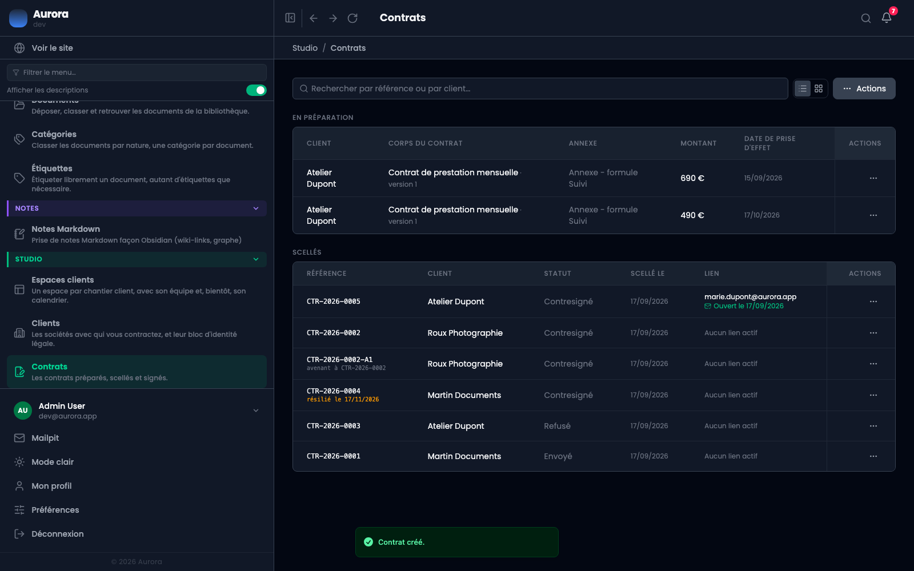
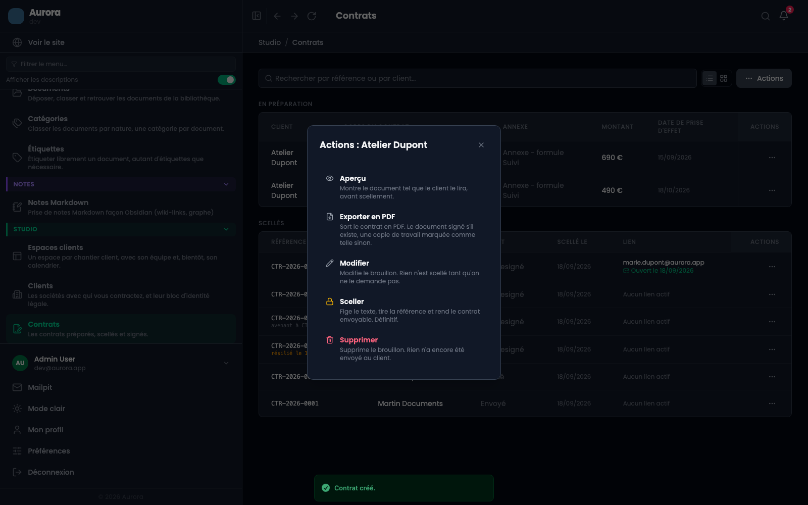
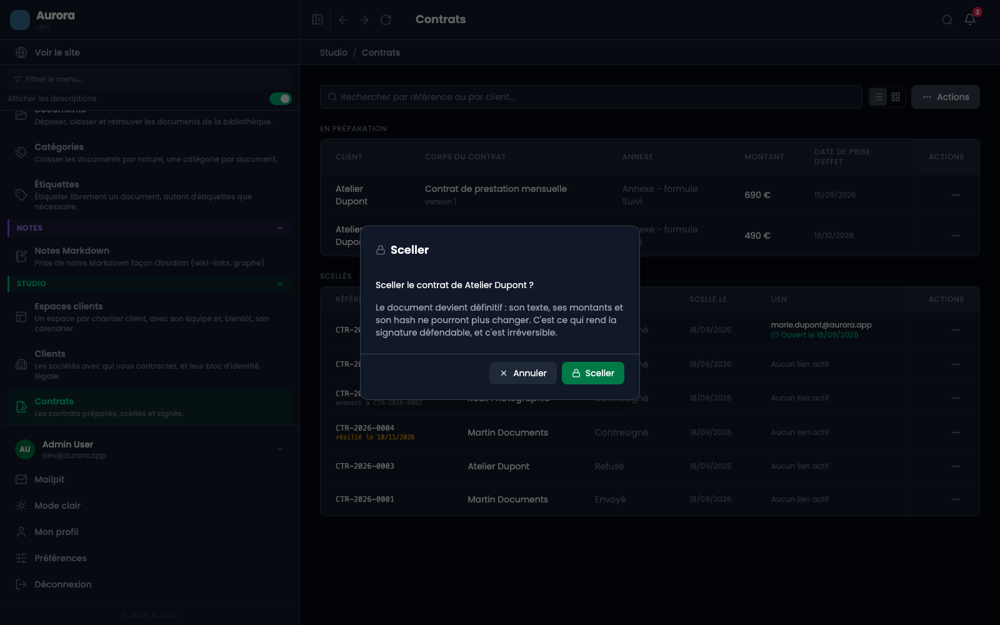
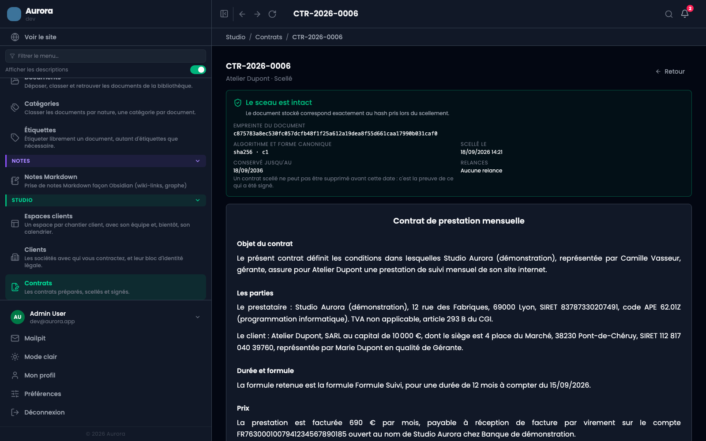

Sceller, c'est arrêter le texte. Le document est rendu une fois pour toutes, la référence est frappée, une empreinte est prise. À partir de là, plus rien du contrat ne bouge.

## Avant de sceller

Relisez : c'est le dernier moment. Un contrat scellé ne se modifie pas, et ne se supprime pas avant la fin de sa durée de conservation. Pour changer quelque chose après, il faudra un avenant, qui est un document à part, signé lui aussi.

Pour relire, l'action **Aperçu** d'un contrat en préparation ouvre le document tel que le client le lira, avec les vraies valeurs de ce contrat. Un champ que la fiche client laisse vide s'affiche vide, parce que c'est ce que le signataire lirait. Seuls la référence et les mentions écrites à la signature apparaissent entre crochets : elles n'existent pas encore.

L'aperçu n'écrit rien et ne tire aucune référence. Il signale aussi les variables inconnues, celles qui bloqueront le scellement : les trouver là ne coûte rien, les trouver au scellement coûte un aller-retour.

## 1. Le brouillon prêt

Le contrat est en préparation, tous ses champs sont remplis, et les blancs demandés par la trame aussi.

## 2. Le menu d'actions

Le bouton en bout de ligne ouvre les trois actions possibles sur un brouillon, chacune avec sa conséquence écrite : modifier, sceller, supprimer. « Supprimer » ne vaut que pour un brouillon, justement parce que rien n'a encore été envoyé.

## 3. La confirmation

Elle rappelle ce que l'opération a de définitif. C'est volontairement un pas de plus, pas un clic direct depuis la liste.

## 4. Le contrat scellé

L'écran du contrat montre ce que le scellement a produit :

- la **référence**, frappée à cet instant et jamais avant, pour qu'aucun numéro ne soit consommé par un brouillon abandonné ;
- l'**empreinte du document**, son algorithme et sa forme canonique ;
- la **date de scellement** et la date jusqu'à laquelle le contrat est conservé ;
- le **document lui-même**, tel qu'il sera lu par le client, jetons remplacés.

Le bandeau « le sceau est intact » compare le document stocké à son empreinte. Il se revérifie à chaque affichage.

## Ce que le scellement refuse

- Un jeton que la trame nomme et que rien ne remplit : le document partirait avec un trou.
- Une identité du prestataire incomplète : les douze réglages doivent être remplis.
- Un blanc de trame laissé vide.
- Un contrat déjà scellé : l'opération ne se rejoue pas.

## Et ensuite

Le contrat est envoyable. L'étape suivante est le lien de signature, qui part par e-mail à l'adresse contractuelle du client.
