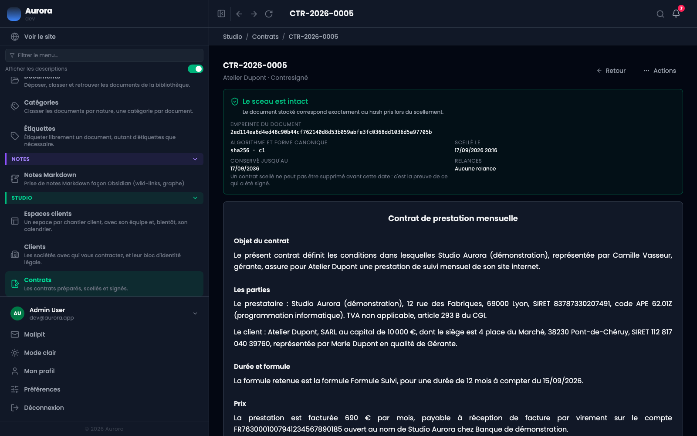

Une fois le contrat conclu, un PDF est produit. Une seule fois, et il ne change plus.

## Le bloc de preuve

Sur la page du contrat, il rassemble ce qui fait la valeur du document : l'empreinte, l'algorithme et la forme canonique, la date de scellement, la date jusqu'à laquelle le contrat est conservé, et le compteur de relances.

Le bandeau « le sceau est intact » compare le document stocké à son empreinte, à chaque affichage.

## Pourquoi une seule fois

Regénérer le PDF produirait ce que le code d'aujourd'hui sait faire, pas ce qui a été signé. Le document est donc rendu une fois, à la conclusion, et conservé tel quel avec sa propre empreinte, distincte de celle du HTML scellé.

## Par où il est servi

Par une adresse dédiée du contrat, réservée à l'administration. Le client, lui, retrouve son exemplaire en rouvrant le lien de signature, qui affiche le contrat signé.

## Sortir un contrat qui n'est pas encore signé

L'action **Exporter en PDF**, dans le menu de chaque ligne de la liste des contrats, répond pour n'importe quel contrat, à n'importe quel moment :

- **contrat conclu** : elle rend le PDF signé, octet pour octet. C'est le même fichier que ci-dessus, et rien n'est régénéré.
- **contrat scellé, pas encore signé** : elle imprime le document tel qu'il a été scellé, avec son bloc de preuve, et un bandeau en première page qui dit que personne ne l'a encore signé.
- **brouillon** : elle imprime ce que le document dirait aujourd'hui, mentions entre crochets comprises, avec un bandeau qui dit que le texte peut encore changer.

Les deux derniers cas sont des **copies de travail** : rien n'est enregistré, aucun cadre de signature vide n'est dessiné, et le nom du fichier porte le suffixe `-projet` pour qu'un dossier de téléchargements ne mélange pas les deux. C'est ce qu'il faut pour faire relire un contrat avant de le sceller, ou pour en classer un exemplaire papier.
