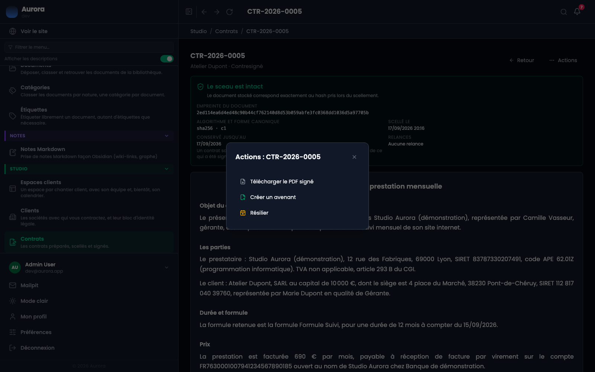
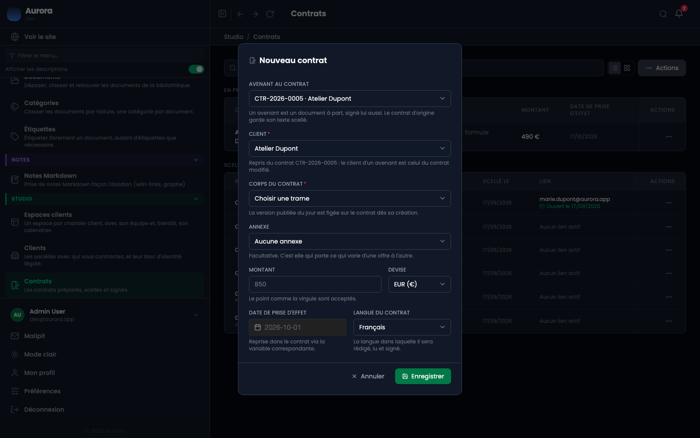

Un avenant modifie un contrat conclu. C'est un document à part, scellé et signé comme le premier : le contrat d'origine, lui, garde son texte intact.

## D'où ça part

De la page d'un contrat conclu, dans son menu **Actions**. Deux entrées y apparaissent, et seulement là : créer un avenant, ou résilier. Ce sont les deux seules choses qui peuvent encore arriver à un contrat signé.

Elles disparaissent si le contrat est lui-même un avenant, ou s'il est déjà résilié.

## La préparation

C'est la fenêtre habituelle, avec le premier champ déjà rempli : « avenant au contrat », suivi de la référence du contrat modifié. Le reste se prépare comme un contrat ordinaire, avec sa propre trame, son montant et sa date d'effet.

La **référence est dérivée** de celle du contrat d'origine, suffixée du rang de l'avenant. Elle est frappée au scellement, comme toute référence.

## Ce que l'avenant ne fait pas

- Il ne modifie pas le texte du contrat d'origine, qui reste scellé tel quel.
- Il ne remplace pas l'annexe d'origine pour la période antérieure : celle-ci continue de décrire ce qui a été exécuté avant.
- Il ne se contresigne pas tout seul : il suit le même parcours, envoi, signature, contresignature.

## La chaîne se lit sur le contrat

La page du contrat d'origine liste ses avenants avec leur état. C'est ce qui permet de savoir, un an plus tard, ce qui s'applique vraiment.
