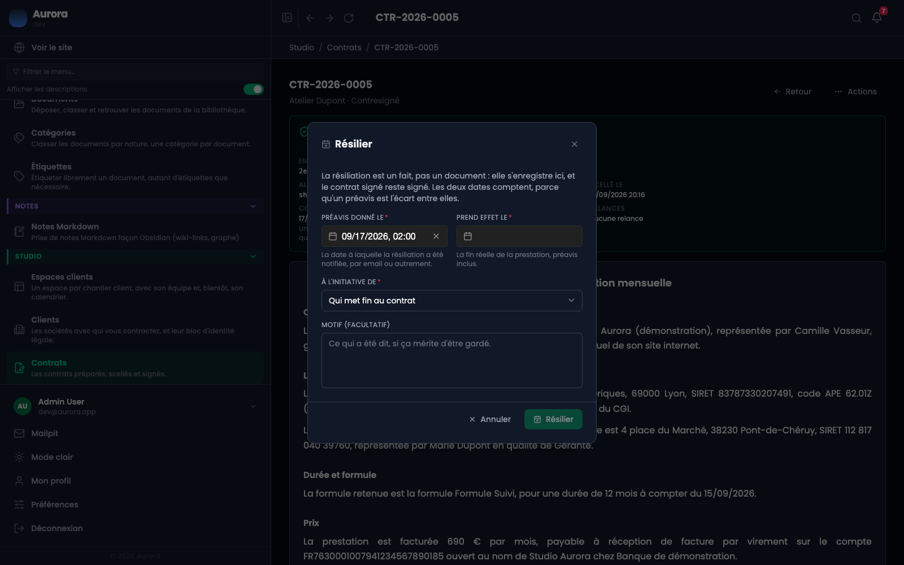

La résiliation est un fait, pas un document. Elle s'enregistre, et le contrat signé reste signé.

## D'où ça part

De la page d'un contrat conclu, dans son menu **Actions**, sous la création d'avenant.

## Les deux dates, et pourquoi elles comptent toutes les deux

- **Préavis donné le** : la date à laquelle la résiliation a été notifiée, par e-mail ou autrement.
- **Prend effet le** : la fin réelle de la prestation, préavis inclus.

Un préavis est l'écart entre les deux. N'enregistrer que la seconde perdrait le fait que le préavis a été donné dans les temps, qui est précisément ce sur quoi porte un désaccord.

## À l'initiative de

Le client, le prestataire, ou les deux parties. Le motif est facultatif : une résiliation se constate, elle ne se justifie pas forcément.

## Ce que ça ne fait pas

Le contrat reste **conclu**. Il n'est ni supprimé, ni annulé, ni rendu modifiable : il a été signé, et ça, rien ne l'efface. La résiliation s'ajoute par-dessus, avec ses dates.

La page affiche ensuite « résiliation en cours, effet au… », puis « contrat résilié depuis le… » une fois la date passée. La liste des contrats le signale aussi, sous la référence.

## Ce que ça refuse

Résilier un contrat qui n'est pas conclu. Un contrat non signé se révoque, ou se fait refuser : ce n'est pas la même chose et le message le dit.
