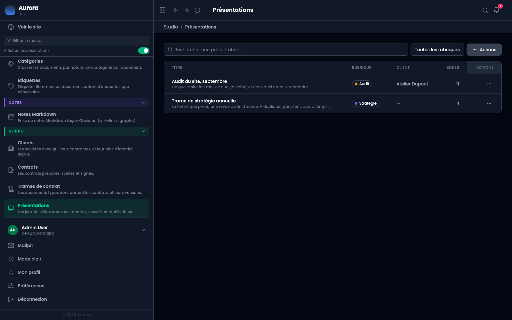
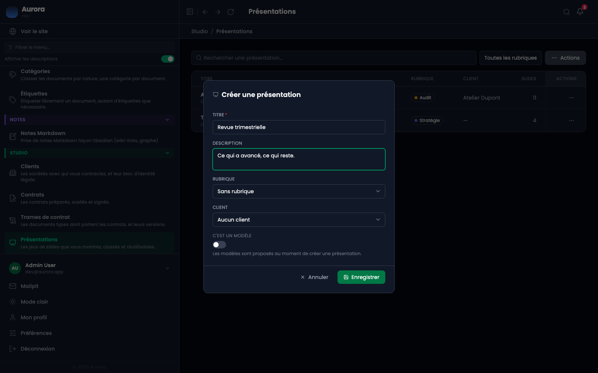
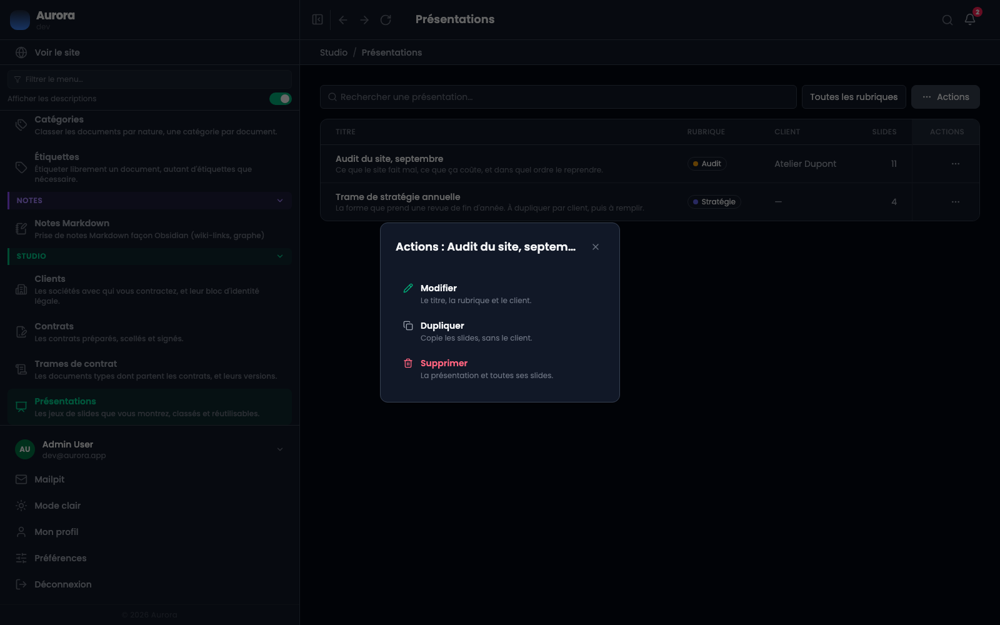

Une présentation est un jeu de slides que vous montrez à quelqu'un : un audit, une revue de fin d'année, une proposition. Elle vit dans Studio parce qu'elle s'adresse à un client, comme un contrat.

## 1. Ouvrir la liste

Studio → Présentations. La recherche porte sur le titre, la description et le nom du client. Le sélecteur à côté filtre par rubrique.

## 2. Créer

Le menu « Actions », en haut à droite de la liste, offre « Créer une présentation ». La fenêtre a quatre champs, dont seul le titre est obligatoire.

## 3. La rubrique et le client

La **rubrique** classe la présentation : audit, stratégie, ce que vous voulez. Elle sert au filtre de la liste.

Le **client** est facultatif, et c'est délibéré. Une trame de stratégie écrite pour vous n'a pas de destinataire, et c'est le cas le plus courant. Supprimer un client ne supprime pas la présentation qu'on lui a montrée : le champ se vide, la présentation reste.

## Dupliquer plutôt que recommencer

Le menu d'une ligne propose « Dupliquer ». La copie emporte les slides et la rubrique, **mais pas le client** : « repartir de celle-ci » veut presque toujours dire la même forme pour quelqu'un d'autre, et emporter le client est la façon dont un deck finit présenté à une société avec le nom d'une autre dessus.

## Les modèles

Une présentation peut être marquée **« C'est un modèle »**, dans la fenêtre qui la crée ou dans celle qui la modifie. Elle porte alors un badge dans la liste, et elle est proposée au moment d'en créer une nouvelle, sous « Partir d'un modèle ».

Partir d'un modèle reprend **ses slides et son apparence**, et rien d'autre : le titre, la rubrique et le client sont ceux que vous venez de saisir. C'est ce qui distingue le modèle de la duplication, laquelle reprend aussi le classement de la présentation copiée.

La présentation ainsi créée **n'est pas elle-même un modèle**. Sans quoi une liste de trois modèles en compte trente au bout d'un mois.

Un modèle reste une présentation ordinaire : elle se compose, se présente, s'imprime et se partage comme les autres. Le jour où vous voulez montrer votre modèle, il n'y a rien à convertir.

## Ce que la liste montre

Le nombre de slides de chaque présentation, sa rubrique, son client s'il y en a un. La colonne de droite trie les plus récemment modifiées en premier : une présentation se retrouve par ce sur quoi on a travaillé récemment, pas par un nom qu'on connaîtrait déjà.
