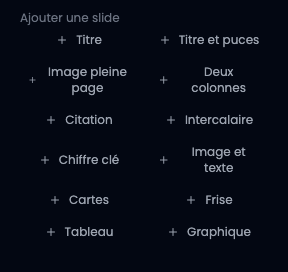
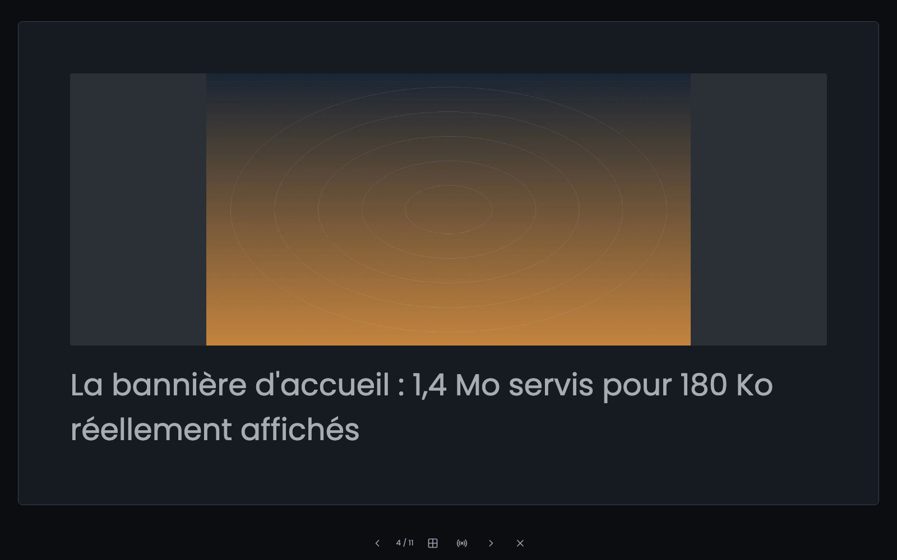
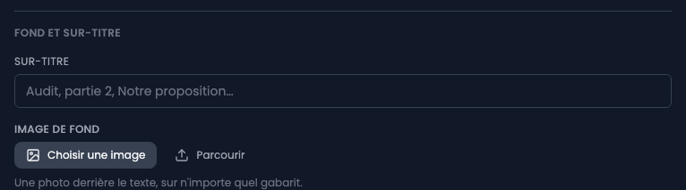

Le titre d'une présentation ouvre sa page : les slides à gauche, celle que vous écrivez à droite, et son aperçu au-dessus du formulaire.


## Il n'y a pas de bouton Enregistrer

Une présentation s'écrit en sautant d'une slide à l'autre, et chaque saut enregistre celle que vous quittez. Fermer l'onglet enregistre aussi. L'indication à droite du gabarit dit où on en est : « Enregistré », « Modifications non enregistrées », « Enregistrement… ».

## 1. Ajouter une slide

Les boutons en bas de la colonne ajoutent une slide à la fin, dans le gabarit choisi.



## 2. Les onze gabarits

- **Titre** : un titre et un sous-titre. Ouvre une présentation.
- **Titre et puces** : le plus utilisé. Une puce par ligne dans le champ.
- **Image pleine page** : une illustration et sa légende.
- **Deux colonnes** : un avant et un après, un constat et une proposition.
- **Citation** : une phrase et son attribution.
- **Intercalaire** : un titre seul, qui annonce ce qui suit.
- **Chiffre clé** : un nombre en grand, et ce qu'il compte.
- **Image et texte** : une capture d'un côté, ce que vous en dites de l'autre.
- **Cartes** : deux à quatre blocs courts côte à côte.
- **Frise** : des étapes dans l'ordre, sur une ligne.
- **Tableau** : quelques lignes, la première servant d'en-tête.
- **Graphique** : des barres, une courbe ou un anneau, dans la couleur d'accent de la présentation.

### Les gabarits qui prennent plusieurs valeurs par ligne

Cartes, frise, tableau et graphique se remplissent comme les puces : **une ligne par élément**. Ce qui change, c'est qu'une ligne peut porter plusieurs valeurs, séparées par une **barre verticale** `|` :

```
Cache | Listes et fiches produit
File | Mails et exports
```

Pour un tableau, la barre sépare les colonnes et la première ligne est l'en-tête. Pour un graphique, chaque ligne est une étiquette et sa valeur : `Accueil | 2,4`. La virgule et le point sont lus de la même façon.

### Mettre un mot en valeur

Dans le texte d'une slide, `**gras**`, `*italique*` et `` `code` `` sont reconnus. Rien d'autre : un titre ou une liste tapés dans un champ resteraient les caractères que vous avez tapés, parce que la mise en page d'une slide est décidée par son gabarit et pas par son texte.

## 3. Un fond et un sur-titre, sur n'importe quel gabarit

Sous les champs du gabarit, un bloc commun à tous :

- **Sur-titre** : une ligne courte au-dessus du titre, dans la couleur d'accent. « Audit », « Partie 2 », « Notre proposition ».
- **Image de fond** : une photo derrière tout le reste, y compris sur un intercalaire ou une citation.
- **Voile** : à quel point cette image est assombrie vers la couleur de fond de la présentation, pour que le texte reste lisible. Quarante pour cent par défaut.



L'image d'une slide n'est pas déposée dans la slide : elle est **choisie dans la médiathèque**. La slide retient l'identifiant du document, pas son adresse, ce qui veut dire que remplacer le fichier dans la médiathèque met la présentation à jour sans y toucher.

Le gabarit d'une slide **peut changer après coup**. Une slide écrite en puces veut souvent devenir un intercalaire une fois que la présentation a pris forme. Les champs que le nouveau gabarit ne porte pas disparaissent alors.




## 4. Les notes d'orateur

Le dernier champ du formulaire est pour vous : ce que vous direz pendant que la slide est à l'écran. **Elles ne sont jamais montrées** au public : ni en mode présentation, ni à l'impression, ni dans un lien de partage. C'est la raison pour laquelle elles sont un champ à part et non un texte de la slide. Le seul endroit qui les affiche est la vue présentateur, qui s'ouvre dans une seconde fenêtre et demande d'être connecté.

## 5. Changer l'ordre, dupliquer une slide

Au survol d'une vignette apparaissent quatre actions : monter, descendre, **dupliquer** et supprimer. Une poignée en bas à droite permet de **glisser la vignette** à sa place.

Les flèches restent à côté de la poignée, et c'est voulu : glisser demande une souris et une main, elles non, et ce sont le seul chemin au clavier vers un changement d'ordre.

Une présentation longue **se replie par chapitres** : sur la vignette d'un intercalaire, un chevron cache les slides qui le suivent et affiche leur nombre. Les chapitres sont lus dans les intercalaires eux-mêmes, il n'y a rien de plus à créer, et une présentation qui n'en utilise pas a simplement un seul chapitre.

La copie d'une slide se pose **juste après celle qu'elle copie**, parce qu'on duplique une slide pour en écrire une variante, et qu'une variante vingt slides plus loin doit être ramenée avant de pouvoir être modifiée.


## L'aperçu est au format réel

Les vignettes et le grand aperçu sont au format 16/9, celui d'un vidéoprojecteur. Ce que vous arrangez là est ce qui arrivera au mur. Une slide trop remplie est rognée dans l'aperçu plutôt qu'agrandie : c'est aussi ce qui lui arrivera en projection.
