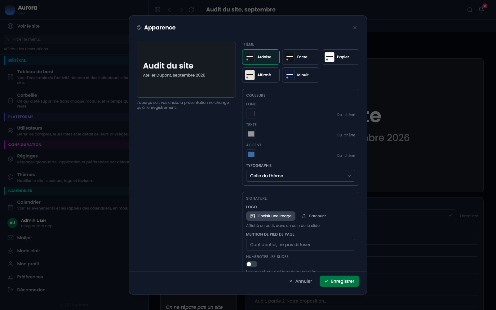
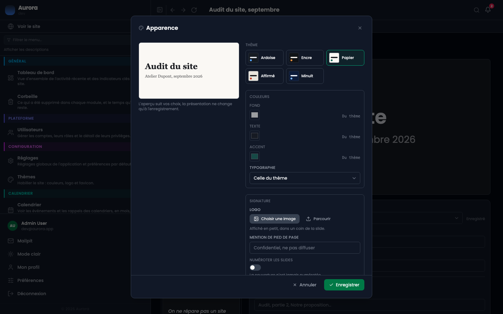

« Apparence », dans le menu « Actions » en haut de la page d'une présentation, décide de quoi elle a l'air. Le choix vaut pour **toutes ses slides** : une présentation est un document, pas une collection de pages indépendantes.

Le panneau montre en permanence une slide de la présentation, redessinée à chaque changement. C'est la question que vous vous posez, donc c'est ce qu'il affiche : rien n'est enregistré tant que vous n'avez pas validé.

## 1. Le thème

Cinq thèmes, chacun un fond, une couleur de texte, une couleur d'accent et une paire de polices.

- **Ardoise** : le gris du back-office. C'est ce que toutes les présentations avaient avant que les thèmes existent, et c'est le thème par défaut.
- **Encre** : presque noir, accent chaud. Le plus lisible sur un vidéoprojecteur.
- **Papier** : clair et calme. Une présentation qui se lit comme un document remis.
- **Affirmé** : clair et contrasté, un rouge qui porte toute la présentation.
- **Minuit** : bleu profond, le registre d'entreprise sans le gris.

## 2. Les couleurs

Les trois couleurs du thème peuvent être remplacées une par une : le fond, le texte, l'accent. Tant que vous n'en changez aucune, la pastille reste estompée et la mention « Du thème » rappelle que c'est le thème qui décide.

**Ce n'est pas un détail.** Une couleur laissée au thème continuera de suivre le thème, y compris si celui-ci est retouché dans une version ultérieure d'Aurora. Une couleur choisie est gelée à ce que vous avez choisi. Le bouton « Tout revenir au thème » efface les trois d'un coup.

L'accent est la couleur des puces, des traits sous les en-têtes de tableau, du bord des cartes, du sur-titre et des graphiques. C'est le seul endroit où une présentation porte une couleur vive, et c'est ce qui la rend reconnaissable.

## 3. La typographie

Quatre paires, sans police à téléverser :

- **Sans empattement** : Poppins, la police d'Aurora.
- **Avec empattements** : la police à empattements du système.
- **Titres serif, texte sans** : l'arrangement d'un magazine.
- **Titres chasse fixe, texte sans** : pour un audit ou une revue technique.

Il n'y a pas de champ pour taper un nom de police, et c'est délibéré : une présentation ouverte par un client depuis un lien de partage doit s'afficher dans ce que vous avez vu, pas dans le repli de son navigateur.

## 4. Le logo et le pied de page

- **Logo** : une image choisie dans la médiathèque, dessinée en petit dans un coin. Trois placements : nulle part, sur la couverture seule, ou sur toutes les slides.
- **Mention de pied de page** : une ligne courte, au centre du bas de chaque slide. « Confidentiel, ne pas diffuser », le nom du client, une date.
- **Numéroter les slides** : le numéro en bas à droite. La couverture n'est jamais numérotée.

## Ce qui suit la présentation

Le thème et ses réglages voyagent avec la présentation partout où elle est dessinée : les vignettes, l'aperçu, le plein écran, la vue présentateur, la page d'impression et le lien de partage. Il n'y a pas d'endroit où elle a l'air d'autre chose.

**Dupliquer une présentation garde son apparence.** C'est même la principale raison d'en dupliquer une : « repartir de celle-ci » veut dire le même thème, le même accent et le même logo, avec d'autres mots dedans.
