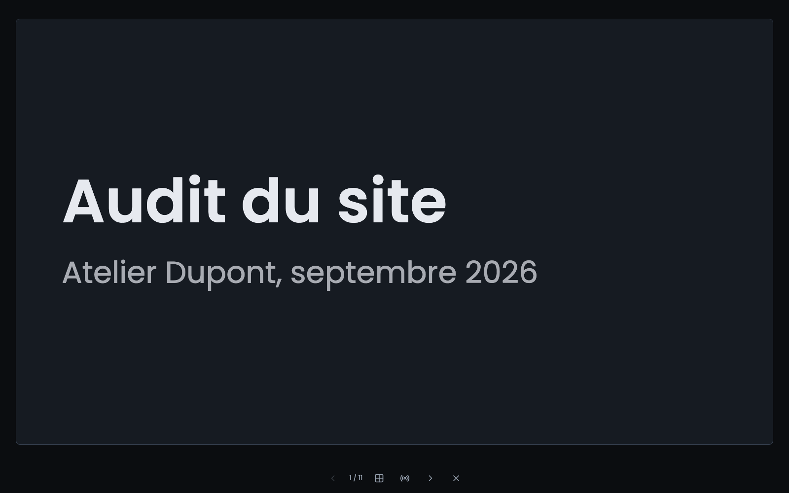
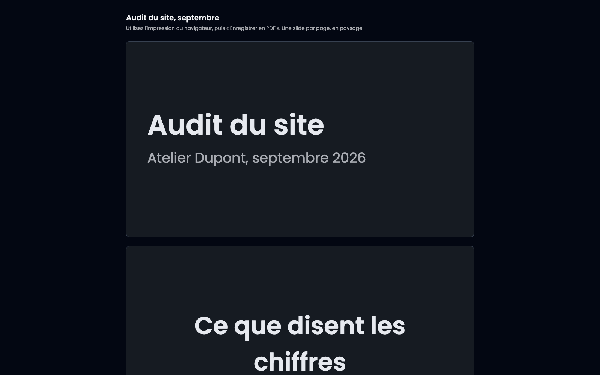

Trois boutons en haut de la page d'une présentation : « Présenter », « Vue présentateur » et « Imprimer ». Tous les trois enregistrent d'abord la slide en cours.

## 1. Présenter

Le plein écran s'ouvre sur la slide sélectionnée, pas forcément la première : on répète souvent une slide précise.

## 2. Se déplacer

- **Flèches** droite et gauche, haut et bas.
- **Espace** pour avancer.
- **Page précédente** et **Page suivante**, qui sont les touches qu'envoie une télécommande de présentation.
- **Échap** pour sortir.

La barre du bas indique où vous en êtes. Elle s'estompe tant que la souris ne la survole pas : sous chaque slide, c'est la seule chose de l'écran que personne n'est venu regarder.

## La slide n'est jamais étirée

Un cadre 16/9 sur un vidéoprojecteur 16/10 laisse des bandes en haut et en bas. C'est voulu : remplir l'écran rognerait un coin de ce que vous avez écrit.

## Vos notes ne sont pas à cet écran

Le mode présentation n'affiche pas les notes d'orateur, et ne les affichera jamais : un seul écran est l'écran du public, donc tout ce qui y est dessiné est public. Vos notes s'ouvrent ailleurs.

## 3. La vue présentateur

« Vue présentateur » ouvre une **seconde fenêtre**, à poser sur votre écran à vous. Elle porte la slide en cours en grand, la suivante en petit, vos notes en gros caractères, et un minuteur.

Les deux fenêtres avancent ensemble : une flèche pressée dans l'une déplace l'autre. Vous pouvez donc avancer avec votre télécommande sur le plein écran, ou depuis la vue présentateur sans toucher à ce que le public voit.

**Ouvrez-la avant de passer en plein écran.** Une fenêtre qui s'ouvre prend le focus, et le navigateur sort alors du plein écran que vous venez de demander.

Le minuteur ne démarre pas tout seul : il attend que vous appuyiez. Vous ouvrez souvent cette fenêtre pendant que la salle se remplit, et un minuteur qui afficherait déjà onze minutes au moment de dire bonjour ne servirait à rien.

La vue présentateur demande d'être connecté, comme le reste du back-office. Un lien de partage n'y donne pas accès, et ne transporte pas les notes.

## 4. Imprimer

« Imprimer » ouvre une page qui ne porte que les slides, une par page, en paysage, et lance le dialogue d'impression.

## Obtenir un PDF

Dans le dialogue d'impression, choisissez « Enregistrer en PDF » comme destination. Il n'y a pas de bouton « Exporter en PDF » ailleurs dans l'application, et c'est un choix : le navigateur qui a dessiné la slide l'imprime exactement telle qu'il l'a dessinée, là où un générateur séparé aurait sa propre idée de la mise en page.

Vérifiez que l'orientation est bien **paysage** si votre navigateur ne l'a pas déduite, et décochez les en-têtes et pieds de page si vous ne voulez pas l'adresse de la page en bas de chaque slide.
