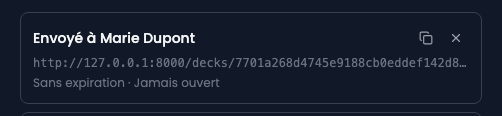

« Partager », dans le menu « Actions » de la présentation, crée une adresse qui l'ouvre sans compte. C'est ce qu'on envoie à un client après un rendez-vous.

## 1. Créer un lien

Un intitulé libre, une expiration facultative, et le lien apparaît dans la liste.

## L'intitulé sert à vous, pas au destinataire

Il n'apparaît nulle part sur la page publique. Il est là pour que la liste reste lisible dans six mois : « envoyé à Marie le 12 septembre » vaut mieux que trois adresses identiques.

## 2. Copier et envoyer

L'icône de copie met l'adresse dans le presse-papiers. Si le navigateur refuse le presse-papiers, l'adresse s'affiche en clair à la place du libellé, à sélectionner à la main.

## 3. Ce que voit le destinataire

Le titre, la description, et les slides les unes sous les autres. Un bouton « Présenter » ouvre le même plein écran que le vôtre.

## Vos notes n'y sont jamais

Les notes d'orateur ne partent pas avec le lien. Elles ne sont pas masquées à l'affichage, elles ne sont pas envoyées du tout.

## La vue est vivante, pas figée

Corriger une faute change ce que voit le destinataire quand il rouvre le lien. C'est ce qu'on attend d'un document partagé, et c'est aussi pourquoi l'expiration existe : un partage oublié continue de publier ce qu'on écrit dans la présentation ensuite.

## 4. Révoquer

L'icône en croix révoque le lien. **La ligne n'est pas supprimée**, elle est estompée : « qui pouvait ouvrir ceci, et jusqu'à quand » est une question à laquelle on veut pouvoir répondre après coup.

Un lien révoqué, expiré ou inventé donne la même réponse : page introuvable. Distinguer les trois confirmerait à quelqu'un qui tâtonne que l'adresse était bonne.

## Les images doivent être publiées

Une image de la médiathèque n'est servie à un visiteur sans compte que si elle est **publiée**. Or une image qui vient d'être téléversée est un brouillon.

Le panneau de partage vous le dit : s'il reste des images non publiées sur la présentation, un encadré les nomme avant que vous créiez le lien. Publiez-les dans la médiathèque et l'avertissement disparaît.

Dans le back-office, ces images s'affichent normalement : l'éditeur, le plein écran, la vue présentateur et la page d'impression passent par une autre porte, celle qui demande un compte. C'est uniquement le destinataire du lien qui ne les verrait pas.

## Protéger un lien par un mot de passe

Le champ **« Mot de passe »**, sous l'intitulé, est facultatif. Laissé vide, le lien s'ouvre avec sa seule adresse, ce qui suffit dans la plupart des cas : elle est impossible à deviner et elle peut expirer.

Rempli, le destinataire tombe d'abord sur une page qui demande ce mot de passe. Cette page **ne dit rien de la présentation** : ni son titre, ni son auteur, ni le nombre de slides. Et un mot de passe faux répond exactement ce que répond une adresse fausse, pour qu'une adresse devinée n'apprenne pas qu'elle est bonne.

**Communiquez-le autrement que par le message qui porte le lien.** Un mot de passe écrit sous l'adresse qu'il protège ne protège rien : il suffit de faire suivre le message.

Une fois ouvert, le lien le reste tant que le navigateur du destinataire n'est pas fermé. Ouvrir un lien protégé n'en ouvre aucun autre.

## Savoir s'il a été ouvert, et combien de fois

Chaque ligne indique combien de fois le lien a été ouvert et la date de la dernière fois, ou « Jamais ouvert ». C'est l'essentiel de ce qui justifie de garder un lien par destinataire plutôt qu'une adresse unique : « est-ce qu'ils l'ont lu, et est-ce qu'ils y sont revenus » est une question qui se répond par un nombre.

Un compteur, et pas un journal. Aurora n'enregistre pas qui a ouvert quoi ni quand exactement, ni quelles slides ont été regardées : une ligne par ouverture serait un relevé des habitudes de lecture de quelqu'un, gardé parce qu'il était facile à garder.
