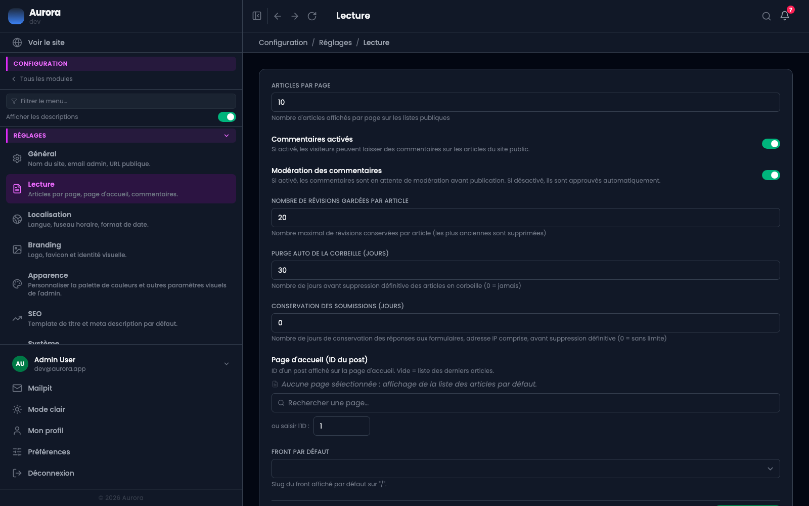

Ce qui règle le comportement du site vis-à-vis du lecteur.

## Ce qui se règle

- La page d'accueil : une publication précise, ou l'archive d'un type par défaut.
- Le nombre de publications par page, dix par défaut.
- Le nombre de révisions gardées par publication, vingt par défaut.
- Le délai de purge automatique de la corbeille, trente jours par défaut. Il vaut pour les cinq corbeilles, pas seulement pour les publications.
- L'ouverture des commentaires sur le site, et l'obligation de modération.
