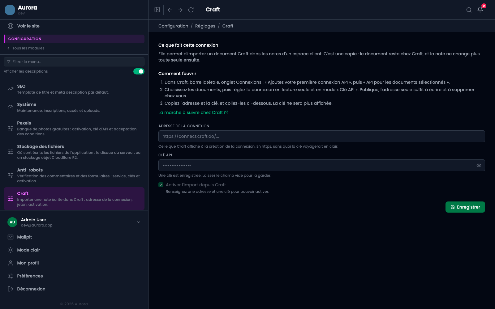
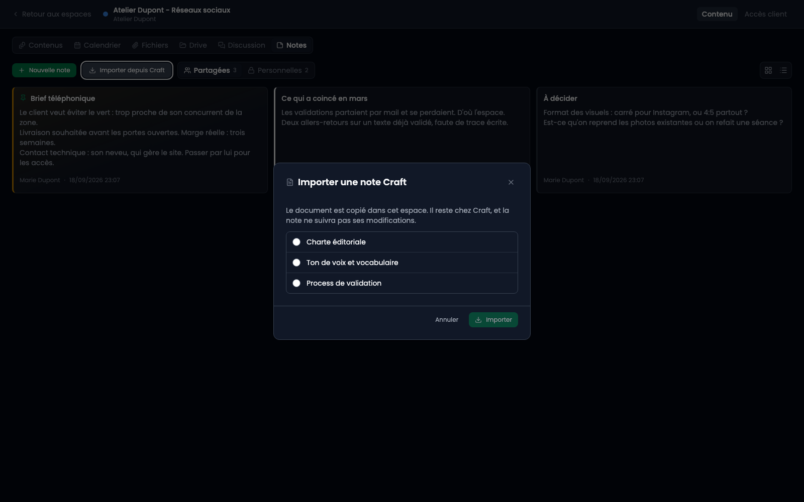

Craft garde le savoir qui survit aux projets : vos méthodes, vos modèles, ce que vous avez appris. Les notes d'un espace gardent ce qui est attaché à un travail en cours et meurt avec lui. Cette connexion fait passer de l'un à l'autre.

## Ce que c'est, et ce que ce n'est pas

C'est une **copie**. Le document reste chez Craft, la note vit ici, et les deux ne se parlent plus ensuite. Modifier la note ne touche pas au document ; modifier le document ne change pas la note tant que vous ne demandez pas la mise à jour.

Le sens est toujours le même : de Craft vers ici. Rien de ce que vous écrivez dans une note ne remonte chez Craft, et la connexion est demandée en lecture seule précisément pour que ce soit vrai même en cas d'erreur de programmation plus tard.

## Créer la connexion chez Craft

Dans Craft, barre latérale, onglet **Connexions**. Choisissez **Ajoutez votre première connexion API**, puis **API pour les documents sélectionnés**, et désignez les documents que vous acceptez de rendre lisibles.

Deux réglages vous sont alors proposés, et le second est le seul qui compte vraiment.

**Niveau d'autorisation : lecture seule.** Il n'y a rien à écrire depuis ici.

**Mode d'accès : Clé API, jamais Publique.** En mode public, l'adresse de la connexion suffit à elle seule : quiconque la connaît lit vos documents, et la connexion annonce elle-même les opérations d'écriture et de suppression qu'elle accepte. Une adresse se retrouve dans un historique de navigation, un presse-papiers, une capture d'écran. En mode Clé API, la même adresse sans la clé répond simplement « non ».

Copiez ensuite l'adresse et la clé. Craft n'affiche la clé qu'une fois.

## Ce que l'écran demande

L'**adresse de la connexion** doit commencer par `https://`. L'écran refuse le reste, et ce n'est pas un excès de zèle : en `http`, la clé voyagerait lisible sur le réseau à chaque appel.

La **clé API** est enregistrée chiffrée et ne sera plus jamais réaffichée. Le champ laissé vide veut dire « garde celle qui est enregistrée », jamais « oublie-la ».

Tant que l'un des deux manque, la case d'activation reste fermée et vous dit pourquoi.

## Importer une note

Une fois la connexion allumée, ouvrez un espace client, onglet **Notes**, bouton **Importer depuis Craft**. La liste montre les documents de la connexion, et rien d'autre : ce que vous n'avez pas sélectionné chez Craft n'existe pas pour l'application.

Le document arrive converti en blocs : titres, listes, citations, tableaux, cases à cocher. **Les images sont téléchargées et rangées dans la médiathèque** au passage, puis la note pointe vers ces copies. Sans cela, une note aurait dépendu d'adresses Craft qui expirent, et se serait vidée de ses illustrations sans prévenir.

Le titre du document devient le titre de la note. Il n'est pas réécrit en tête du corps : Craft enveloppe chaque document dans son propre titre, et le recopier tel quel l'aurait affiché deux fois.

## Mettre une note à jour

Une note importée garde le souvenir du document dont elle vient. Le bouton **Mettre à jour depuis Craft** la remet sur la version actuelle.

**Le corps est remplacé.** Ce que vous avez modifié dans la note depuis l'import est perdu, et l'écran vous le dit avant de le faire. La couleur, l'épingle et la visibilité, elles, sont conservées : ce sont des décisions qui vous appartiennent et qui n'ont pas d'équivalent chez Craft.

C'est le bon outil quand Craft reste la source et que la note est un reflet. Quand la note a pris sa propre vie, ne la mettez plus à jour.

## Quand ça ne répond pas

L'écran distingue les cas plutôt que de dire « erreur », parce qu'ils ne se réparent pas au même endroit.

**Craft n'a pas répondu** désigne l'adresse ou la clé, donc les réglages.

**Aucun document dans cette connexion** veut dire que la connexion existe et répond, mais qu'aucun document ne lui a été rattaché. Cela se règle chez Craft.

**L'import n'est pas activé** est le cas le plus simple : la case des réglages n'est pas cochée.
