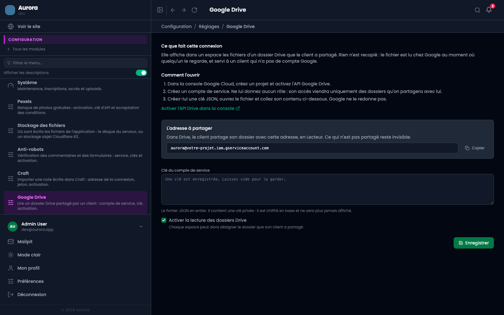
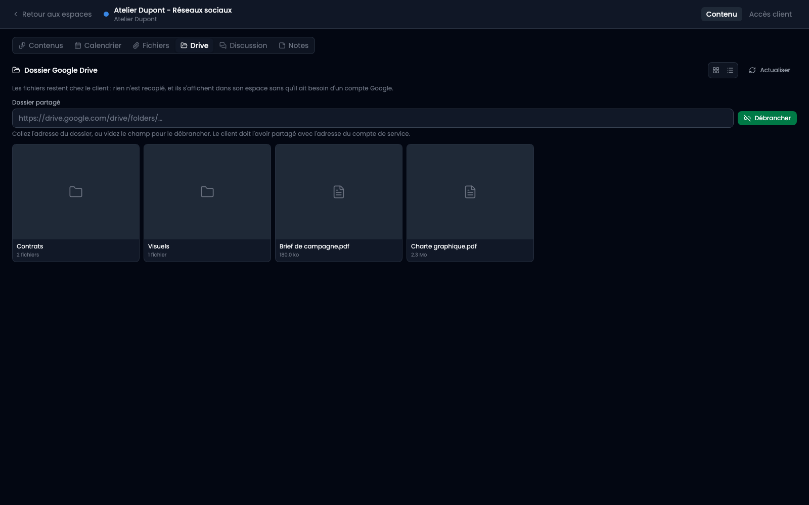

Un espace client peut désigner un dossier Google Drive que son client a partagé. Les fichiers y apparaissent, côté studio comme dans la page que le client ouvre par son lien d'accès.

## Rien n'est recopié

Le fichier reste chez le client. Il est lu chez Google au moment où quelqu'un le regarde, et servi sous une adresse de l'application.

Cela a trois conséquences qui valent d'être sues. Retirer un fichier du dossier partagé le retire de l'espace, ce qu'on attend d'un dossier partagé plutôt que d'une copie qui vieillit. Le client de l'espace **n'a besoin d'aucun compte Google** : une adresse Drive lui opposerait un mur d'authentification, puisque le dossier n'est partagé qu'avec le compte de service et pas avec lui. Et rien n'occupe votre stockage.

## Un compte de service, pas une autorisation par navigateur

Le chemin habituel demanderait à une personne d'autoriser l'application dans son navigateur, avec un écran de consentement, un jeton à garder vivant, et une réautorisation le jour où il expire.

Un compte de service a simplement une adresse, et vos clients partagent un dossier avec elle comme ils le feraient avec un collègue. La portée se décide donc chez eux, pas ici : ce qui n'est pas partagé n'existe pas pour ce compte, et retirer le partage referme la porte sans toucher à aucun réglage.

## Créer la clé

Dans la console Google Cloud, créez un projet, puis activez l'**API Google Drive** dessus. Le lien de l'écran de réglages y mène directement.

Créez ensuite un **compte de service**. Ne lui donnez aucun rôle : son accès viendra uniquement des dossiers qu'on partagera avec lui, et un rôle de projet ne servirait qu'à lui accorder plus que nécessaire.

Créez-lui enfin une **clé JSON**. Google télécharge un fichier et ne le redonne jamais. Ouvrez-le, copiez son contenu entier, collez-le dans le champ de l'écran de réglages.

**Ce fichier contient une clé privée.** Il est enregistré chiffré et ne sera plus jamais réaffiché. Traitez-le comme un mot de passe : ne le collez nulle part ailleurs, et ne le transmettez à personne.

## L'adresse à faire partager

Une fois la clé enregistrée, l'écran affiche en clair l'**adresse du compte de service**. Ce n'est pas un secret, et c'est la moitié utile de cet écran : elle se recopie à chaque nouveau client.

Le client ouvre son dossier dans Drive, partage avec cette adresse, en **Lecteur**. Le partage se transmet aux sous-dossiers, donc un dossier parent partagé une fois suffit pour tous les espaces qui vivront dessous.

## Désigner le dossier d'un espace

Dans un espace client, vue **Drive**, collez l'adresse du dossier telle que Drive l'affiche dans la barre du navigateur. L'identifiant nu est accepté aussi, mais rien n'oblige à aller le chercher : l'écran découpe l'adresse.

Vider le champ débranche le dossier. Cela ne supprime rien chez le client, et ne touche pas au partage.

## Ce que l'écran montre

Les sous-dossiers s'ouvrent, avec un fil d'Ariane pour remonter. La descente ramène l'arborescence entière en une fois, et l'arbre se reconstruit ensuite dans le navigateur : entrer dans un dossier et en ressortir ne coûte aucun appel.

Les fichiers s'affichent en cartes ou en liste, au choix, et en liste d'office quand la colonne est trop étroite pour une vignette. Un clic ouvre l'aperçu, d'où le fichier se télécharge sous son vrai nom.

Deux bornes existent. La descente s'arrête à **cinq niveaux**, parce qu'un raccourci circulaire dans un Drive la ferait tourner sans fin. Et à **deux cents fichiers**, parce qu'au-delà ce n'est plus une liste qu'on parcourt des yeux : c'est dans Drive que ça se range.

## Ce que le client voit

Les mêmes fichiers, dans la page qu'il ouvre par son lien d'accès, avec le téléchargement à côté de chaque ligne.

Les fichiers passent par le même contrôle que la page elle-même : **révoquer un lien d'accès referme le dossier** à l'instant où il referme la page. Aucune adresse Drive n'est donnée au client, et aucun intermédiaire ne garde les fichiers en cache.

Un fichier qu'un navigateur exécuterait comme un document, un HTML ou un SVG, est toujours téléchargé plutôt qu'affiché : servi dans un onglet, son script tournerait sous le domaine de l'application avec la session de celui qui regarde.

## Lecture seule, et dite à Google

Le jeton est demandé pour la portée « lecture seule ». Même si une requête d'écriture était écrite par erreur un jour, Google la refuserait. Une intégration qui ne peut pas écrire est une intégration qui ne peut pas abîmer le Drive d'un client.

## Quand rien n'apparaît

Un dossier vide et un dossier non partagé se ressemblent à l'écran, et l'application le dit dans les deux sens : le message nomme les deux causes plutôt que d'en supposer une.

Dans l'ordre des choses à vérifier : le partage a-t-il bien été fait avec l'adresse du compte de service, et non avec la vôtre ; l'API Drive est-elle activée sur le projet ; la case d'activation est-elle cochée dans les réglages.
